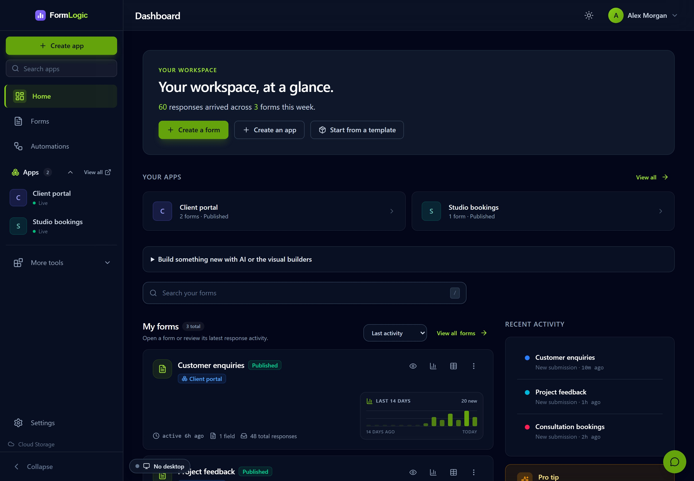
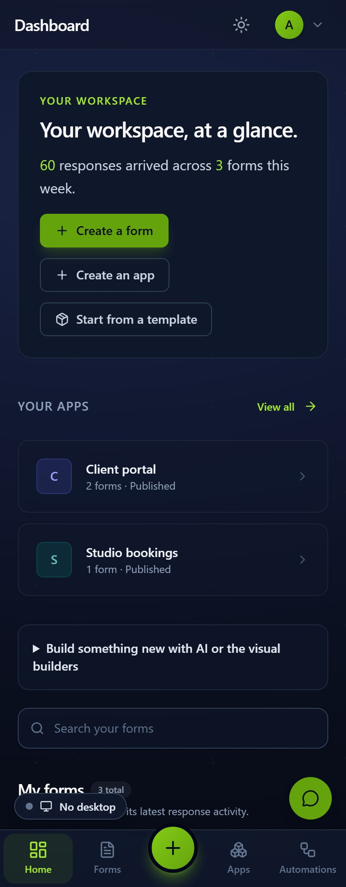
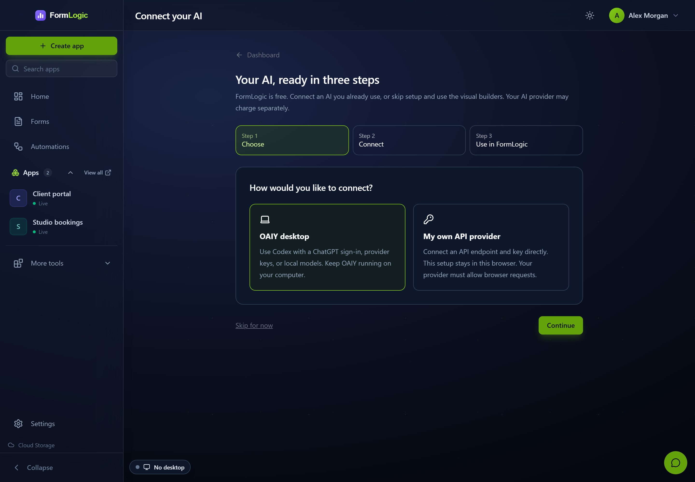

<h1 align="center">FormLogic</h1>

<p align="center"><strong>Build forms and business apps with a backend, a database and the AI you choose.</strong></p>

<p align="center">
  Create forms, dashboards, portals and automations in one workspace. Build editable apps with <strong>Softn</strong>, host them on FormLogic, and connect <strong>OAIY</strong> for AI and local services. Add <strong>Aokie</strong> when calls, messages and appointments belong in the same app.
</p>

<p align="center">
  
  
  
  
</p>

<p align="center">
  <a href="https://formlogic.com/#live-demo"><strong>Try the live demo</strong></a>
  ·
  <a href="https://formlogic.com/signup"><strong>Build your first app</strong></a>
  ·
  <a href="https://formlogic.com/aokie"><strong>Meet Aokie</strong></a>
  ·
  <a href="#self-host-formlogic"><strong>Self-host FormLogic</strong></a>
</p>

<p align="center">
  
</p>
<p align="center"><sub>Actual running interface, captured September 2026 with fictional studio data. See <a href="docs/images/README.md">screenshot details</a>.</sub></p>

---

## From a form to a connected app

1. **Start with your data.** Create a form visually, use AI, or choose a marketplace starter.
2. **Build the workspace.** Add screens, dashboards, reports, branding, members and roles in App Studio.
3. **Connect the work.** Use flows and scripts to turn submissions and device events into the next action.
4. **Make it your own.** Create a portable interface, download its editable `.softn` project, or host your own client with private `.logic` actions and SQLite storage.
5. **Share the same records.** Add forms to another app without copying the data, or move a complete integration after reviewing its permissions.

<table>
  <tr>
    <td width="34%" align="center">
      
    </td>
    <td width="66%" valign="top">
      <h3>A workspace that fits the screen</h3>
      <p>Forms, apps and automations stay within reach on desktop and mobile. See recent activity, open the relevant tool and move between your apps from the same dashboard.</p>
      <p><strong>Forms:</strong> validation, conditional logic, linked records, uploads and custom screens.</p>
      <p><strong>Apps:</strong> branded portals, shared data, role-aware navigation, charts and reports.</p>
      <p><strong>Automation:</strong> visual flows, private backend actions, scoped APIs and connected devices.</p>
      <p><a href="https://formlogic.com/#live-demo">Explore a populated demo</a> · <a href="docs/CONNECTED_APPS.md">How connected workspaces work</a></p>
    </td>
  </tr>
</table>

## One connected platform

| Layer | What it owns | What it unlocks |
|---|---|---|
| **FormLogic** | Forms, records, apps, access control, flows, hosting and APIs | A shared backend and operational workspace |
| **[Softn](https://github.com/f2i-com/softn.com)** | Portable app interfaces and client logic | Editable `.softn` clients that can run inside a compatible host |
| **OAIY** (paired desktop, separate repository) | Local models, services, supervised plugins, hardware connectors and headless flow execution | Local capability with cloud visibility—even when the browser is closed |
| **Aokie** | Bluetooth phone control, live call audio, speech and durable call/SMS events | A phone receptionist whose conversations become structured business work |

You can use the visual builders without connecting AI. Pair OAIY when you need local models, services, devices or background execution. FormLogic owns the app records and permissions; the connected runtime owns its local capabilities.

---

## Add Aokie to your front desk

**Calls, appointments, messages, transcripts, follow-ups and device logs in one app.** The Aokie starter includes a portable front-desk interface, and the same forms can be shared with an existing FormLogic app. That app keeps its original home and gains a **Front desk** view.

Aokie runs as an OAIY plugin and connects to a compatible phone over Bluetooth. FormLogic stores the resulting records and runs the business workflows. Use **Open call controls**, **Manage appointments** and **Manage messages** to move from the overview to the relevant tools.

### What happens on a call

1. A call rings on the paired mobile phone.
2. Aokie receives call control and audio over Bluetooth HFP/SCO.
3. Local speech recognition turns the caller's voice into text.
4. A local—or explicitly configured remote—language model chooses a reply and text-to-speech plays it back.
5. Durable events become FormLogic call records, transcript turns, caller details, summaries, appointment requests and follow-up work.
6. Flows can notify staff, look up a returning caller, update records, draft a response or route the next action.

### Built for an actual front desk

- **Custom receptionist** with your business name, greeting, voice, model and instructions.
- **Incoming and outgoing calls** with answer, reject, hang up, outbound dialing and operator speech.
- **Conversation history** with caller and assistant turns, overlap labels and interrupted replies.
- **Messages and follow-ups** with incoming SMS, reviewed drafts and configured callback workflows.
- **Waiting-call visibility** with a read-only summary of waiting and held callers in OAIY.
- **Natural interruption** with optional barge-in and echo cancellation.
- **Local-first voice loop** using local speech recognition, a local LLM and local text-to-speech by default.
- **Remote visibility** through the FormLogic app while Desktop handles the local phone connection.
- **Crash-safe delivery** through a write-before-emit event outbox with acknowledgements, replay and idempotency.
- **Privacy-aware operation** with DPAPI-protected transcript/SMS outbox payloads and conversation content excluded from logs by default.
- **Safer defaults**: auto-answer is opt-in and defaults off.

> [!IMPORTANT]
> Aokie is a **hardware beta** for Windows 10/11 x64 and requires a supported USB Bluetooth dongle. It captures appointment requests for staff or a configured flow to confirm; it should not be treated as silently confirming bookings on its own. Local processing is the default path, but any remote AI or speech endpoint you configure receives the audio or text it needs.

[Explore Aokie](https://formlogic.com/aokie) · [Read the hardware guide](https://github.com/f2i-com/aokie.com/blob/main/docs/HARDWARE.md) · [Open the Aokie repository](https://github.com/f2i-com/aokie.com)

---

## One backend, many portals

Forms are shared data models—not copies trapped inside separate apps. Attach the same forms to several experiences and give each one its own audience, branding and permissions.

<p align="center">
  
</p>

A customer can submit and track their own request. A field worker can see the queue and update the job. An administrator can access every record, dashboard and report. All three views work over the same data.

- Each app keeps its own slug, branding, members, roles, navigation and dashboards.
- The form keeps its schema, validation, linked records, scripts, webhooks and responses.
- Server-side filtering removes forms, navigation, reports and widgets a member cannot see.
- **Create companion app** builds a second portal over the existing forms without cloning the records.

The complete model is documented in [One backend, many portals](docs/ONE_BACKEND_MANY_PORTALS.md).

## Build it your way

### Forms that grow into software

Build focused public forms or complete data models with short and long text, email, phone, number, date/time, choices, ratings, signatures, uploads, locations, calculated values, hidden values and linked records. Add validation, conditional logic, version history, webhooks and a server-side `onSubmit` script.

### Dashboards without dashboard code

Compose KPI, bar, line, area, pie, donut, table, record-list and activity widgets in a drag-and-drop grid. Give the app home screen and each form section its own operational view, then turn the same data into printable PDF reports.

### Client apps and private backend logic

- **Softn clients** combine `.ui` interfaces and `.logic` behavior in an editable app project.
- **Hosted backend actions** run private `.logic` code with permission-checked, transactional SQLite record operations.
- **Sandboxed app logic** runs lifecycle hooks and returns permission-checked effects.
- **Custom screens** run as sandboxed HTML/CSS/JavaScript behind an iframe and postMessage SDK.
- **FormLogic SDK** provides permission-aware React hooks and components for first-party screens.
- **Server scripts** run in a budgeted ZIPP sandbox with guarded access to record and HTTP helpers.

### Visual flows that do real work

React to form submissions, connector events and manual runs. Branch, transform and format data, call an OpenAI-compatible model, operate connectors, drive approved local services and read or write FormLogic records. Runs are tracked with correlation IDs, idempotency and history.

### Bring your own AI

Open **Connect your AI** and follow **Choose → Connect → Use in FormLogic**.

- **OAIY Desktop:** connect Codex, a provider API or local models, then approve FormLogic's pairing request.
- **Your own API provider:** use the browser's provider editor, test the connection and choose a default. The provider must allow browser requests.
- **External AI clients:** use scoped OAuth/MCP access to create and edit apps, forms, screens, roles, flows and hosted projects.

<p align="center">
  
</p>
<p align="center"><sub>Actual setup screen with a fictional account. No AI provider is connected in this demo.</sub></p>

FormLogic defaults to free access and bring-your-own AI. Your provider may charge separately. Operator-funded Site AI is off by default; some specialised generation routes still require it. See [AI setup and optional plans](docs/FREE_PLANS_AND_AI_SETUP.md) for the current scope.

### Portable by design

- Export forms and responses as familiar files.
- Download an editable `.softn` client, or export a signed `.formlogic` package or JSON pack.
- Host custom apps with private backend actions and a separate app database.
- Downloaded clients contain interface code, not account credentials or an offline copy of the backend.
- Review capabilities and trust level before importing a package.
- Run in the hosted service, on your own infrastructure, as a PWA or through the native runtime.

## Start from a working business app

FormLogic ships **29 marketplace packs** backed by real forms, linked records, roles, dashboards, reports and populated demos. Several packs include more than one portal, producing **32 demo apps** in the no-signup gallery.

| Trades & field service | Hospitality & food | Health, beauty & fitness |
|---|---|---|
| Plumbing, workshop, handyman, cleaning and pet-care operations | Café, burger, restaurant, catering and short-stay operations | Salon, training/coaching and clinic front-desk operations |

| Retail & operations | Compliance & field ops | Business, finance & voice |
|---|---|---|
| Inventory, retail-store and fleet operations | OHS/quality, construction and agriculture | Billing, repairs, HR, service, events, finance and Aokie |

<details>
<summary><strong>View all 29 marketplace packs</strong></summary>

| App | Category | What it runs |
|---|---|---|
| Plumbing & Trades Field Service | Trades & Field Service | Customers → jobs → site visits → invoices → parts |
| Mechanic Workshop Manager | Trades & Field Service | Customers → vehicles → job cards → parts → invoices |
| Property Maintenance & Handyman | Trades & Field Service | Properties → tenants → requests → work orders → inspections |
| CleanShift — Cleaning Scheduler | Trades & Field Service | Clients → teams → jobs → quality checks → supplies → issues |
| PawRoute — Dog Walking & Pet Care | Trades & Field Service | Clients → pets → bookings → visits → incidents → care notes |
| BrewDesk — Cafe & Barista Ops | Hospitality & Food | Orders → barista queue → menu → stock → roster → daily close |
| GrillStack — Burger Command Center | Hospitality & Food | Orders → kitchen pass → prep → stock → shifts → close |
| PassMaster — Restaurant Service | Hospitality & Food | Reservations → tables → orders → kitchen tickets → shift close |
| CaterCraft — Catering & Events | Hospitality & Food | Clients → packages → events → production → deliveries |
| StayReady — Short-Stay Turnover | Hospitality & Food | Properties → bookings → turnovers → inspections → supplies |
| Hair Salon & Beauty Studio | Beauty, Health & Fitness | Clients → services → stylists → appointments → product sales |
| FitStudio — Training & Coaching | Beauty, Health & Fitness | Clients → trainers → sessions → assessments → payments |
| Clinic Appointment & Intake | Beauty, Health & Fitness | Patients → providers → requests → intake → follow-ups |
| Inventory & Purchase Orders | Retail & Operations | Products → suppliers → purchase orders → stock movements |
| CounterFlow — Retail Store Ops | Retail & Operations | Products → suppliers → stock → tasks → returns |
| FleetFlow — Fleet & Driver Log | Retail & Operations | Vehicles → drivers → trips → fuel → maintenance → incidents |
| OHS & Quality Management | Field Ops & Compliance | Incidents → hazards → audits → corrective actions → NCRs |
| SitePulse — Construction Site Diary | Field Ops & Compliance | Projects → diaries → deliveries → defects → variations |
| AgriLog — Farm Jobs & Harvest | Field Ops & Compliance | Paddocks → jobs → harvests → chemicals → machinery |
| VenueOps — Venue Hire & Bookings | Bookings & Education | Spaces → hirers → bookings → setups → payments → incidents |
| TutorTrack — Tutoring & Lessons | Bookings & Education | Students → tutors → lessons → progress → invoices |
| Event Management | Bookings & Education | Registration → speakers → vendors → volunteers → feedback |
| Job & Invoice Management | Billing & Business | Clients → jobs → quotes → invoices → payments |
| RepairBench — Device Repair Shop | Billing & Business | Customers → devices → repairs → parts → sign-off → pickup |
| HR & People Management | Billing & Business | Recruitment → onboarding → leave → reviews → training → exits |
| Customer Service | Billing & Business | Tickets → bugs → requests → refunds → escalations → knowledge |
| Finance OS (US) | Finance | RIA/broker-dealer onboarding, compliance and advisory |
| Finance OS (AU) | Finance | AFSL advice, Best Interest Duty, super and AUSTRAC workflows |
| Aokie Receptionist | AI & Voice | Calls → transcript turns → callers → requests → follow-ups |

</details>

---

## Start in the way that suits you

| Path | Best for | Start here |
|---|---|---|
| **Explore** | Seeing complete apps before creating an account | [Open the populated live demo](https://formlogic.com/#live-demo) |
| **Hosted** | Getting started without managing infrastructure | [Create an account](https://formlogic.com/signup)—free access with bring-your-own AI |
| **Self-hosted** | Keeping the full deployment on infrastructure you control | Use the assisted installer below |
| **Desktop + Aokie** | Local AI, devices, headless flows and phone calls | [Follow the Aokie setup guide](https://formlogic.com/aokie) |

FormLogic defaults to **free access**. Payments are **off by default**. Administrators can enable an optional Supporter plan and edit its name, description and price; the default is **$5 USD per 30 days**, prepaid with no automatic renewal. Free access continues independently of support payments. [Plan configuration](docs/FREE_PLANS_AND_AI_SETUP.md)

## Self-host FormLogic

### Requirements

| Requirement | Version / notes |
|---|---|
| PHP | 8.2+ with `pdo_mysql`, `pdo_sqlite`, `mbstring`, `json`, `openssl` and `fileinfo` |
| MySQL | 8.0+ |
| Node.js | 20.19+ (20.x), 22.13+ (22.x), or 24+ for frontend development and checks |
| Composer | Any recent release |

Node.js is a build dependency for the web client, not an API runtime requirement. The existing server-script and hosted-action sandboxes require their packaged binaries. Hosted apps also need PDO SQLite and the generated Softn host assets.

### Assisted CLI install

```bash
git clone git@github.com:f2i-com/formlogic.com.git

# Keep the shared app engine alongside FormLogic.
git clone https://github.com/f2i-com/softn.com.git
cd softn.com
npm install
cd ../formlogic.com/formlogic/ui
npm install
npm run build:hosted-runtime

# The installer can now build the web client.
cd ..
chmod +x install.sh
./install.sh
```

The installer creates environment files, generates security keys and prepares the database. Build the shared app host first: every frontend build requires its generated assets, including the build performed by the installer.

### Browser installer

Serve the repository from your web root and open:

```text
http://localhost/<your-folder>/formlogic/install.php
```

> [!WARNING]
> Delete `install.php` after setup, serve only the backend `public/` directory and use HTTPS in production.

For manual development setup, production web-server examples, environment variables, tests and troubleshooting, see [formlogic/README.md](formlogic/README.md) and [DEPLOYMENT.md](DEPLOYMENT.md).

### Build the portable app host

Keep `softn.com` beside `formlogic.com` and install dependencies in both repositories. From `formlogic/ui`:

```sh
npm run build:hosted-runtime
npm run build
```

The first command builds the shared Softn runtime and generates `public/hosted-runtime/`. Those build artifacts stay out of Git; include them in the deployment. [Hosted apps guide](docs/HOSTED_APPS.md) covers private actions, SQLite storage, static-asset headers and backups.

For local development, Vite keeps requests on `/api` and proxies to `http://127.0.0.1:8080`. Set `VITE_API_PROXY_TARGET` to change that target.

## Under the hood

| Layer | Technology |
|---|---|
| Web client | React 19, TypeScript, Vite 7, Tailwind CSS 4, Zustand, React Router and Recharts |
| Builder & flows | dnd-kit, XYFlow, Monaco, ZIPP WASM and Web Workers |
| API | PHP 8.2+, Slim 4, PHP-DI and Monolog |
| Data | MySQL for platform metadata, SQLite response databases per form and a separate SQLite database per hosted app |
| Portable apps | Softn interfaces and client logic, a sandboxed host frame and private backend actions |
| Sandboxed scripting | ZIPP in a browser worker and a bounded server sandbox, including hosted `.logic` actions |
| Desktop | Tauri v2 and Rust; Windows UI plus a headless runtime |
| Aokie | Rust, WinUSB, Bluetooth HFP/SCO/MAP, ONNX speech and a versioned JSON-RPC plugin contract |
| Authentication | HttpOnly signed sessions, scoped API keys, OAuth/MCP tokens and optional TOTP MFA |

```text
formlogic.com/
├── formlogic/
│   ├── backend/          PHP/Slim API, workers, migrations and storage
│   ├── ui/               React builder, app runtime, dashboards and flows
│   └── native-runtime/   Signed-manifest native application shell
├── docs/                 Architecture, API, MCP, pack and operations docs
└── DEPLOYMENT.md         Production deployment and recovery guide

oaiy.com/                 Desktop services, providers, plugin host and flow runner
softn.com/                Shared app engine, builder and FormLogic host

aokie.com/
├── crates/aokie-plugin/      OAIY plugin and durable event bridge
├── crates/aokie-bluetooth/   HFP/SCO/MAP/PBAP radio runtime
├── crates/aokie-dongle/      Dongle discovery and guarded driver management
├── crates/aokie-ai/          Local ONNX speech runtimes
└── docs/                     Architecture, hardware and frozen contracts
```

## Quality and security gates

Automatic push/PR and scheduled CI checks are currently paused. Run checks locally; retained manual workflows are available from GitHub Actions. Manual packaging still invokes its release verification jobs. OAIY and Aokie maintain their own Rust/Windows checks.

```bash
# Backend
cd formlogic/backend
composer test
composer analyse

# Frontend
cd ../ui
npm test
npm run lint
npm run build
npm run test:e2e

# Aokie repository
cargo test --workspace
cargo check -p aokie-plugin --features voice
cargo clippy --workspace --all-targets
```

Security controls include server-enforced RBAC, HttpOnly session cookies, CSRF protection, endpoint-specific rate limits, optional TOTP MFA, sandboxed user code, SSRF-guarded outbound requests, custom-screen no-egress CSP, signed packages/manifests and a hash-chained audit log. The authenticated **Doctor** view checks critical production dependencies and configuration after a deploy or restore.

<details>
<summary><strong>Current beta boundaries</strong></summary>

- The hosted service is in public beta.
- The paired desktop (OAIY) currently targets Windows; the web app works across modern browsers.
- Aokie is a Windows hardware beta and only catalogued Bluetooth dongles are supported.
- Aokie auto-answer defaults off and must be explicitly enabled.
- Local models are the default Aokie path; configured remote providers receive the data required for their request.
- Aokie records appointment requests for confirmation unless you deliberately build a flow that performs the final booking.
- Desktop/Aokie Windows release artifacts may trigger SmartScreen until production code signing is completed.
- The Aokie plugin emits SMS records and can send messages; it should not yet be presented as a full mirrored phone inbox.

</details>

## Documentation

| Guide | What it covers |
|---|---|
| [Documentation index](docs/README.md) | Current guides, task-based entry points and historical design references |
| [Developer setup](formlogic/README.md) | Local development, environment variables, tests and web-server configuration |
| [Deployment](DEPLOYMENT.md) | Production checklist, backups, workers, health checks and recovery |
| [External API](docs/API.md) | Scoped API keys and the REST endpoint reference |
| [MCP](docs/MCP.md) | Connecting your own AI with scoped access |
| [FormLogic Flows](docs/FORMLOGIC_FLOWS.md) | Graph contract, bindings, execution and run history |
| [Desktop pairing (historical)](docs/FORMLOGIC_DESKTOP.md) | How the paired-desktop contract was designed; the app itself is now OAIY |
| [Custom app platform](docs/CUSTOM_APP_PLATFORM.md) | App logic, custom screens, SDK, connectors and domains |
| [Connected apps](docs/CONNECTED_APPS.md) | Portable dashboards, sharing forms, Aokie integration and MCP setup |
| [Hosted apps](docs/HOSTED_APPS.md) | Softn clients, private `.logic` actions, SQLite storage and deployment |
| [AI setup and plans](docs/FREE_PLANS_AND_AI_SETUP.md) | Bring-your-own AI, optional support and administrator controls |
| [Package format](docs/PACK_FORMAT.md) | Signed `.formlogic` packages, manifests and trust |
| [Native runtime](docs/NATIVE_RUNTIME_TAURI.md) | Deep links, signed manifests, connectors and offline queue |
| [Aokie operations](docs/AOKIE_OPERATIONS.md) | Desktop stack, deployment, diagnostics and event recovery |
| [Aokie troubleshooting](docs/AOKIE_TROUBLESHOOTING.md) | Concrete call, audio, flow and hardware failure modes |

## License

FormLogic is **proprietary, source-available software**—it is not open source. Subject to the full [LICENSE](LICENSE), you may self-host it, use it for free and modify it for your own use, including to run your own for-profit business. You may not resell FormLogic, offer it as a competing paid/hosted service or charge others to run it without a commercial licence.

Aokie is also proprietary and versioned separately in the [Aokie repository](https://github.com/f2i-com/aokie.com).

---

<p align="center">
  <strong>Your forms, apps, data and automations, connected.</strong>
</p>

<p align="center">
  <a href="https://formlogic.com/">FormLogic.com</a>
  ·
  <a href="https://formlogic.com/docs">Documentation</a>
  ·
  <a href="mailto:hello@formlogic.com">hello@formlogic.com</a>
</p>
