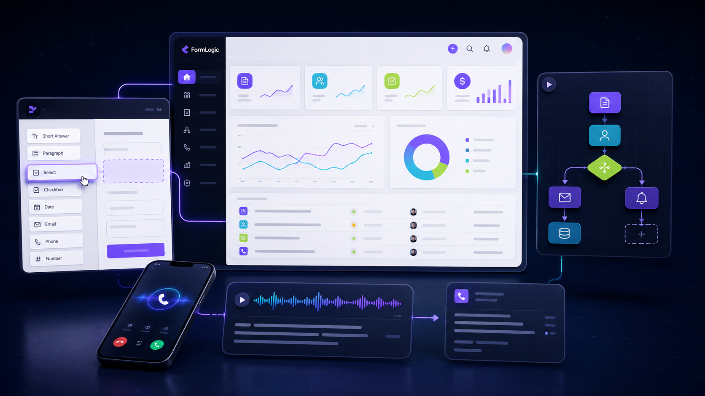
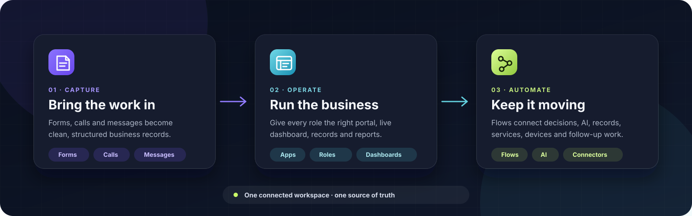
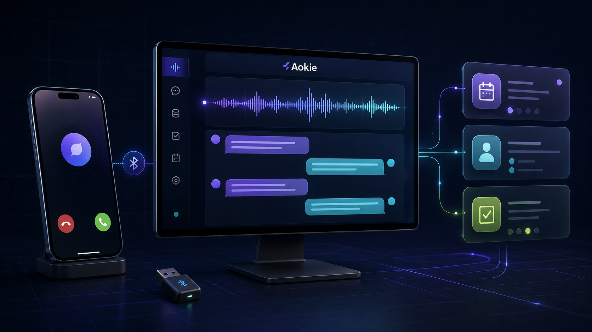
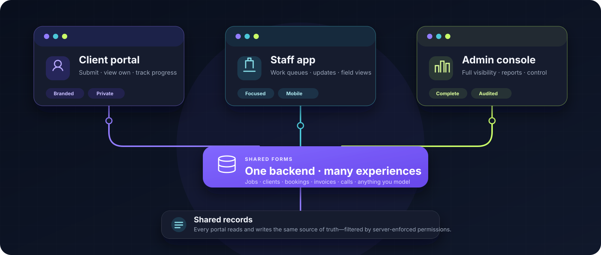

<p align="center">
  
</p>

<h1 align="center">FormLogic</h1>

<p align="center"><strong>Forms become apps. Calls become work. Automations keep it moving.</strong></p>

<p align="center">
  FormLogic is a source-available, self-hostable platform for building connected forms, business apps, portals, dashboards and flows. Add FormLogic Desktop for local AI, hardware and headless automation—including <strong>Aokie</strong>, the AI receptionist that brings real phone calls into your business workflows.
</p>

<p align="center">
  
  
  
  
</p>

<p align="center">
  <a href="https://formlogic.com/#live-demo"><strong>Try the live demo</strong></a>
  ·
  <a href="https://formlogic.com/signup"><strong>Build your first app</strong></a>
  ·
  <a href="https://formlogic.com/aokie"><strong>Meet Aokie</strong></a>
  ·
  <a href="#self-host-formlogic"><strong>Self-host FormLogic</strong></a>
</p>

<p align="center"><sub>Product illustration. Real product screens are shown below.</sub></p>

---

## Most form tools stop at submit. FormLogic carries the work forward.

Start with a form. Turn its data into a branded client portal, a focused staff app and a full admin console. Add live dashboards and printable reports. Then connect events, decisions, AI, records, services and devices in visual flows.

<p align="center">
  
</p>

| Capture | Operate | Automate |
|---|---|---|
| Collect structured data through **23 field types**, public forms, embedded forms, calls and messages. | Turn shared forms into **apps and portals** with their own branding, navigation, roles, dashboards and reports. | Connect triggers, decisions, AI, records and devices in **flows** that can keep running through Desktop with the browser closed. |

FormLogic is designed around one idea: the interface, the data and the automation should stay connected. A submission is not the end of the workflow—it is the beginning.

## See the product, not just the promise

<table>
  <tr>
    <td width="50%">
      
      <br />
      <sub><strong>Build:</strong> drag-and-drop fields, validation, logic, themes, screens, flows and live preview.</sub>
    </td>
    <td width="50%">
      
      <br />
      <sub><strong>Operate:</strong> real records, KPI cards, charts, activity, role-aware navigation and reports.</sub>
    </td>
  </tr>
</table>

The same form can work on its own, appear inside several apps, feed a dashboard, trigger a flow, expose a scoped API and become part of a portable app package.

## One connected platform

| Layer | What it owns | What it unlocks |
|---|---|---|
| **FormLogic Web** | Forms, records, apps, roles, dashboards, reports, flows, marketplace and APIs | A shared operational workspace your team can reach anywhere |
| **FormLogic Desktop** | Local models, services, supervised plugins, hardware connectors and headless flow execution | Local capability with cloud visibility—even when the browser is closed |
| **Aokie** | Bluetooth phone control, live call audio, speech and durable call/SMS events | A phone receptionist whose conversations become structured business work |

You can use FormLogic entirely in the browser. Desktop is the optional local capability layer; Aokie is its flagship hardware plugin.

---

## Meet Aokie: your phone, now with a front desk

<p align="center">
  
</p>

<p align="center"><sub>Product illustration. Aokie is currently a Windows hardware beta.</sub></p>

**Aokie brings the phone into FormLogic.** Pair a supported USB Bluetooth dongle with the business mobile you already use and Aokie can answer through the phone's hands-free link, understand the caller, speak naturally and file the result into FormLogic.

> **Your phone stays the phone. Aokie behaves like a hands-free kit. FormLogic becomes the front desk.**

### What happens on a call

1. A call rings on the paired mobile phone.
2. Aokie receives call control and audio over Bluetooth HFP/SCO.
3. Local speech recognition turns the caller's voice into text.
4. A local—or explicitly configured remote—language model chooses a reply and text-to-speech plays it back.
5. Durable events become FormLogic call records, transcript turns, caller details, summaries, appointment requests and follow-up work.
6. Flows can notify staff, look up a returning caller, update records, draft a response or route the next action.

### Built for an actual front desk

- **Custom receptionist** with your business name, greeting, voice, model and instructions.
- **Real call controls** for answer, reject, hang up and operator speech.
- **Natural interruption** with optional barge-in and echo cancellation.
- **Local-first voice loop** using local speech recognition, a local LLM and local text-to-speech by default.
- **Remote visibility** through the FormLogic app while Desktop handles the local phone connection.
- **Crash-safe delivery** through a write-before-emit event outbox with acknowledgements, replay and idempotency.
- **Privacy-aware operation** with DPAPI-protected transcript/SMS outbox payloads and conversation content excluded from logs by default.
- **Safer defaults**: auto-answer is opt-in and defaults off.

> [!IMPORTANT]
> Aokie is a **hardware beta** for Windows 10/11 x64 and requires a supported USB Bluetooth dongle. It captures appointment requests for staff or a configured flow to confirm; it should not be treated as silently confirming bookings on its own. Local processing is the default path, but any remote AI or speech endpoint you configure receives the audio or text it needs.

[Explore Aokie](https://formlogic.com/aokie) · [Read the hardware guide](https://github.com/f2i-com/aokie.com/blob/main/docs/HARDWARE.md) · [Open the Aokie repository](https://github.com/f2i-com/aokie.com)

---

## One backend, many portals

Forms are shared data models—not copies trapped inside separate apps. Attach the same forms to several experiences and give each one its own audience, branding and permissions.

<p align="center">
  
</p>

A customer can submit and track their own request. A field worker can see the queue and update the job. An administrator can access every record, dashboard and report. All three views work over the same data.

- Each app keeps its own slug, branding, members, roles, navigation and dashboards.
- The form keeps its schema, validation, linked records, scripts, webhooks and responses.
- Server-side filtering removes forms, navigation, reports and widgets a member cannot see.
- **Create companion app** builds a second portal over the existing forms without cloning the records.

The complete model is documented in [One backend, many portals](docs/ONE_BACKEND_MANY_PORTALS.md).

## Build it your way

### Forms that grow into software

Build focused public forms or complete data models with short and long text, email, phone, number, date/time, choices, ratings, signatures, uploads, locations, calculated values, hidden values and linked records. Add validation, conditional logic, version history, webhooks and a server-side `onSubmit` script.

### Dashboards without dashboard code

Compose KPI, bar, line, area, pie, donut, table, record-list and activity widgets in a drag-and-drop grid. Give the app home screen and each form section its own operational view, then turn the same data into printable PDF reports.

### Real code—behind explicit boundaries

- **QuickJS app logic** runs lifecycle hooks and returns permission-checked effects.
- **Custom screens** run as sandboxed HTML/CSS/JavaScript behind an iframe and postMessage SDK.
- **FormLogic SDK** provides permission-aware React hooks and components for first-party screens.
- **Server scripts** run in a budgeted QuickJS sandbox with guarded access to record and HTTP helpers.

### Visual flows that do real work

React to form submissions, connector events and manual runs. Branch, transform and format data, call an OpenAI-compatible model, operate connectors, drive approved local services and read or write FormLogic records. Runs are tracked with correlation IDs, idempotency and history.

### AI on your terms

- Generate forms and multi-form apps from a prompt, document or image with an OpenAI-compatible provider.
- Use a cloud model, LM Studio, Ollama, vLLM or another compatible local endpoint.
- Connect Claude, Cursor or another MCP client through scoped OAuth and let it create or edit forms, apps, screens, dashboards, reports and flows.
- MCP access is scoped; submission data is not exposed by default.

### Portable by design

- Export forms and responses as familiar files.
- Export a complete app as a signed `.formlogic` package or editable JSON pack.
- Review capabilities and trust level before importing a package.
- Run in the hosted service, on your own infrastructure, as a PWA or through the native runtime.

## Start from a working business app

FormLogic ships **29 marketplace packs** backed by real forms, linked records, roles, dashboards, reports and populated demos. Several packs include more than one portal, producing **32 demo apps** in the no-signup gallery.

| Trades & field service | Hospitality & food | Health, beauty & fitness |
|---|---|---|
| Plumbing, workshop, handyman, cleaning and pet-care operations | Café, burger, restaurant, catering and short-stay operations | Salon, training/coaching and clinic front-desk operations |

| Retail & operations | Compliance & field ops | Business, finance & voice |
|---|---|---|
| Inventory, retail-store and fleet operations | OHS/quality, construction and agriculture | Billing, repairs, HR, service, events, finance and Aokie |

<details>
<summary><strong>View all 29 marketplace packs</strong></summary>

| App | Category | What it runs |
|---|---|---|
| Plumbing & Trades Field Service | Trades & Field Service | Customers → jobs → site visits → invoices → parts |
| Mechanic Workshop Manager | Trades & Field Service | Customers → vehicles → job cards → parts → invoices |
| Property Maintenance & Handyman | Trades & Field Service | Properties → tenants → requests → work orders → inspections |
| CleanShift — Cleaning Scheduler | Trades & Field Service | Clients → teams → jobs → quality checks → supplies → issues |
| PawRoute — Dog Walking & Pet Care | Trades & Field Service | Clients → pets → bookings → visits → incidents → care notes |
| BrewDesk — Cafe & Barista Ops | Hospitality & Food | Orders → barista queue → menu → stock → roster → daily close |
| GrillStack — Burger Command Center | Hospitality & Food | Orders → kitchen pass → prep → stock → shifts → close |
| PassMaster — Restaurant Service | Hospitality & Food | Reservations → tables → orders → kitchen tickets → shift close |
| CaterCraft — Catering & Events | Hospitality & Food | Clients → packages → events → production → deliveries |
| StayReady — Short-Stay Turnover | Hospitality & Food | Properties → bookings → turnovers → inspections → supplies |
| Hair Salon & Beauty Studio | Beauty, Health & Fitness | Clients → services → stylists → appointments → product sales |
| FitStudio — Training & Coaching | Beauty, Health & Fitness | Clients → trainers → sessions → assessments → payments |
| Clinic Appointment & Intake | Beauty, Health & Fitness | Patients → providers → requests → intake → follow-ups |
| Inventory & Purchase Orders | Retail & Operations | Products → suppliers → purchase orders → stock movements |
| CounterFlow — Retail Store Ops | Retail & Operations | Products → suppliers → stock → tasks → returns |
| FleetFlow — Fleet & Driver Log | Retail & Operations | Vehicles → drivers → trips → fuel → maintenance → incidents |
| OHS & Quality Management | Field Ops & Compliance | Incidents → hazards → audits → corrective actions → NCRs |
| SitePulse — Construction Site Diary | Field Ops & Compliance | Projects → diaries → deliveries → defects → variations |
| AgriLog — Farm Jobs & Harvest | Field Ops & Compliance | Paddocks → jobs → harvests → chemicals → machinery |
| VenueOps — Venue Hire & Bookings | Bookings & Education | Spaces → hirers → bookings → setups → payments → incidents |
| TutorTrack — Tutoring & Lessons | Bookings & Education | Students → tutors → lessons → progress → invoices |
| Event Management | Bookings & Education | Registration → speakers → vendors → volunteers → feedback |
| Job & Invoice Management | Billing & Business | Clients → jobs → quotes → invoices → payments |
| RepairBench — Device Repair Shop | Billing & Business | Customers → devices → repairs → parts → sign-off → pickup |
| HR & People Management | Billing & Business | Recruitment → onboarding → leave → reviews → training → exits |
| Customer Service | Billing & Business | Tickets → bugs → requests → refunds → escalations → knowledge |
| Finance OS (US) | Finance | RIA/broker-dealer onboarding, compliance and advisory |
| Finance OS (AU) | Finance | AFSL advice, Best Interest Duty, super and AUSTRAC workflows |
| Aokie Receptionist | AI & Voice | Calls → transcript turns → callers → requests → follow-ups |

</details>

---

## Start in the way that suits you

| Path | Best for | Start here |
|---|---|---|
| **Explore** | Seeing complete apps before creating an account | [Open the populated live demo](https://formlogic.com/#live-demo) |
| **Hosted** | Getting started without managing infrastructure | [Create an account](https://formlogic.com/signup)—free during public beta, no card required |
| **Self-hosted** | Keeping the full deployment on infrastructure you control | Use the assisted installer below |
| **Desktop + Aokie** | Local AI, devices, headless flows and phone calls | [Follow the Aokie setup guide](https://formlogic.com/aokie) |

Hosted FormLogic is free during public beta. After beta, Personal access is prepaid at **$5 per 30 days** with no auto-renewal; self-hosting remains free, and Enterprise deployment/support is available separately.

## Self-host FormLogic

### Requirements

| Requirement | Version / notes |
|---|---|
| PHP | 8.2+ with `pdo_mysql`, `pdo_sqlite`, `mbstring`, `json`, `openssl` and `fileinfo` |
| MySQL | 8.0+ |
| Node.js | 20.19+ or 22.12+ for the Vite frontend build |
| Composer | Any recent release |

Node.js is not needed on the production server at runtime. Server-side user logic runs through the vendored QuickJS binary.

### Assisted CLI install

```bash
git clone git@github.com:f2i-com/formlogic.com.git
cd formlogic.com/form-builder
chmod +x install.sh
./install.sh
```

The installer creates the environment files, generates security keys and prepares the database.

### Browser installer

Serve the repository from your web root and open:

```text
http://localhost/<your-folder>/form-builder/install.php
```

> [!WARNING]
> Delete `install.php` after setup, serve only the backend `public/` directory and use HTTPS in production.

For manual development setup, production web-server examples, environment variables, tests and troubleshooting, see [form-builder/README.md](form-builder/README.md) and [DEPLOYMENT.md](DEPLOYMENT.md).

## Under the hood

| Layer | Technology |
|---|---|
| Web client | React 19, TypeScript, Vite 7, Tailwind CSS 4, Zustand, React Router and Recharts |
| Builder & flows | dnd-kit, XYFlow, Monaco, QuickJS WASM and Web Workers |
| API | PHP 8.2+, Slim 4, PHP-DI and Monolog |
| Data | MySQL for platform metadata plus one SQLite response database per form |
| Sandboxed scripting | QuickJS in the browser and a vendored static QuickJS binary on the server |
| Desktop | Tauri v2 and Rust; Windows UI plus a headless runtime |
| Aokie | Rust, WinUSB, Bluetooth HFP/SCO/MAP, ONNX speech and a versioned JSON-RPC plugin contract |
| Authentication | HttpOnly signed sessions, scoped API keys, OAuth/MCP tokens and optional TOTP MFA |

```text
formlogic.com/
├── form-builder/
│   ├── backend/          PHP/Slim API, workers, migrations and storage
│   ├── ui/               React builder, app runtime, dashboards and flows
│   ├── desktop/          Tauri Desktop, local services, plugins and flow runner
│   └── native-runtime/   Signed-manifest native application shell
├── docs/                 Architecture, API, MCP, pack and operations docs
└── DEPLOYMENT.md         Production deployment and recovery guide

aokie.com/
├── crates/aokie-plugin/      FormLogic Desktop plugin and durable event bridge
├── crates/aokie-bluetooth/   HFP/SCO/MAP/PBAP radio runtime
├── crates/aokie-dongle/      Dongle discovery and guarded driver management
├── crates/aokie-ai/          Local ONNX speech runtimes
└── docs/                     Architecture, hardware and frozen contracts
```

## Quality and security gates

Release tags are gated by backend tests, frontend unit tests, type checking, linting, production builds, security invariants and full-stack Playwright golden paths. Desktop and Aokie have their own Rust/Windows test gates.

```bash
# Backend
cd form-builder/backend
composer test
composer analyse

# Frontend
cd ../ui
npm test
npm run lint
npm run build
npm run test:e2e

# Aokie repository
cargo test --workspace
cargo check -p aokie-plugin --features voice
cargo clippy --workspace --all-targets
```

Security controls include server-enforced RBAC, HttpOnly session cookies, CSRF protection, endpoint-specific rate limits, optional TOTP MFA, sandboxed user code, SSRF-guarded outbound requests, custom-screen no-egress CSP, signed packages/manifests and a hash-chained audit log. The authenticated **Doctor** view checks critical production dependencies and configuration after a deploy or restore.

<details>
<summary><strong>Current beta boundaries</strong></summary>

- The hosted service is in public beta.
- FormLogic Desktop's packaged UI currently targets Windows; the web app works across modern browsers.
- Aokie is a Windows hardware beta and only catalogued Bluetooth dongles are supported.
- Aokie auto-answer defaults off and must be explicitly enabled.
- Local models are the default Aokie path; configured remote providers receive the data required for their request.
- Aokie records appointment requests for confirmation unless you deliberately build a flow that performs the final booking.
- Desktop/Aokie Windows release artifacts may trigger SmartScreen until production code signing is completed.
- The Aokie plugin emits SMS records and can send messages; it should not yet be presented as a full mirrored phone inbox.

</details>

## Documentation

| Guide | What it covers |
|---|---|
| [Developer setup](form-builder/README.md) | Local development, environment variables, tests and web-server configuration |
| [Deployment](DEPLOYMENT.md) | Production checklist, backups, workers, health checks and recovery |
| [External API](docs/API.md) | Scoped API keys and the REST endpoint reference |
| [MCP](docs/MCP.md) | Connecting your own AI with scoped access |
| [FormLogic Flows](docs/FORMLOGIC_FLOWS.md) | Graph contract, bindings, execution and run history |
| [FormLogic Desktop](docs/FORMLOGIC_DESKTOP.md) | Pairing, local services, plugins and headless flows |
| [Custom app platform](docs/CUSTOM_APP_PLATFORM.md) | QuickJS logic, custom screens, SDK, connectors and domains |
| [Package format](docs/PACK_FORMAT.md) | Signed `.formlogic` packages, manifests and trust |
| [Native runtime](docs/NATIVE_RUNTIME_TAURI.md) | Deep links, signed manifests, connectors and offline queue |
| [Aokie operations](docs/AOKIE_OPERATIONS.md) | Desktop stack, deployment, diagnostics and event recovery |
| [Aokie troubleshooting](docs/AOKIE_TROUBLESHOOTING.md) | Concrete call, audio, flow and hardware failure modes |

## License

FormLogic is **proprietary, source-available software**—it is not open source. Subject to the full [LICENSE](LICENSE), you may self-host it, use it for free and modify it for your own use, including to run your own for-profit business. You may not resell FormLogic, offer it as a competing paid/hosted service or charge others to run it without a commercial licence.

Aokie is also proprietary and versioned separately in the [Aokie repository](https://github.com/f2i-com/aokie.com).

---

<p align="center">
  <strong>Build the front door. Run the work behind it. Automate what comes next.</strong>
</p>

<p align="center">
  <a href="https://formlogic.com/">FormLogic.com</a>
  ·
  <a href="https://formlogic.com/docs">Documentation</a>
  ·
  <a href="mailto:hello@formlogic.com">hello@formlogic.com</a>
</p>
