# FormLogic

**FormLogic is a self-hostable platform that turns forms into complete business apps.** Build (or install) a set of linked forms, compose them into an app with roles and dashboards, and run it on the web, on your own domain, or in a native desktop/mobile shell — with your own AI able to build and edit apps for you over MCP.

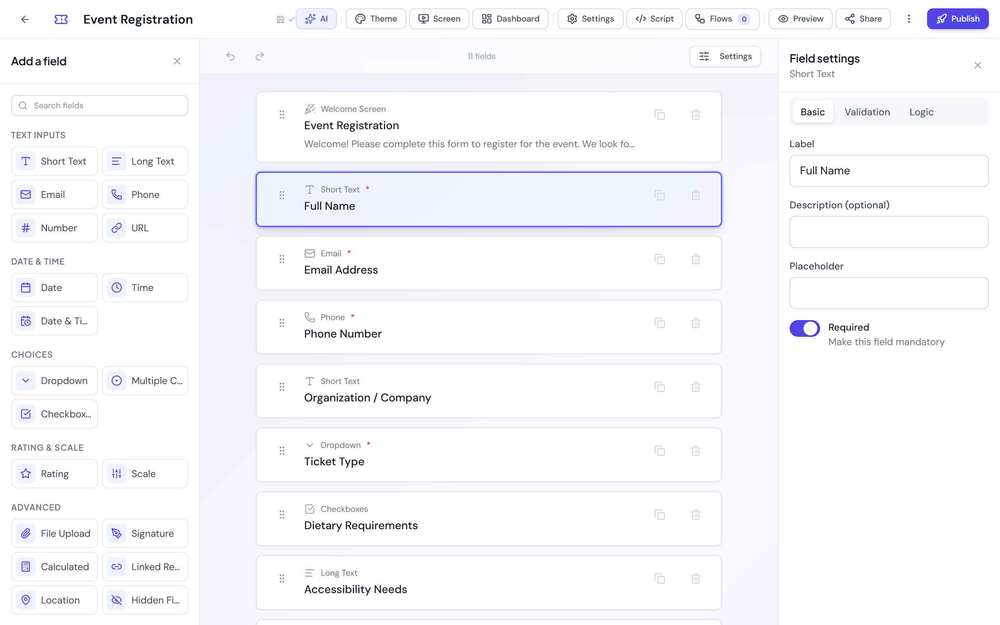

<p align="center">
  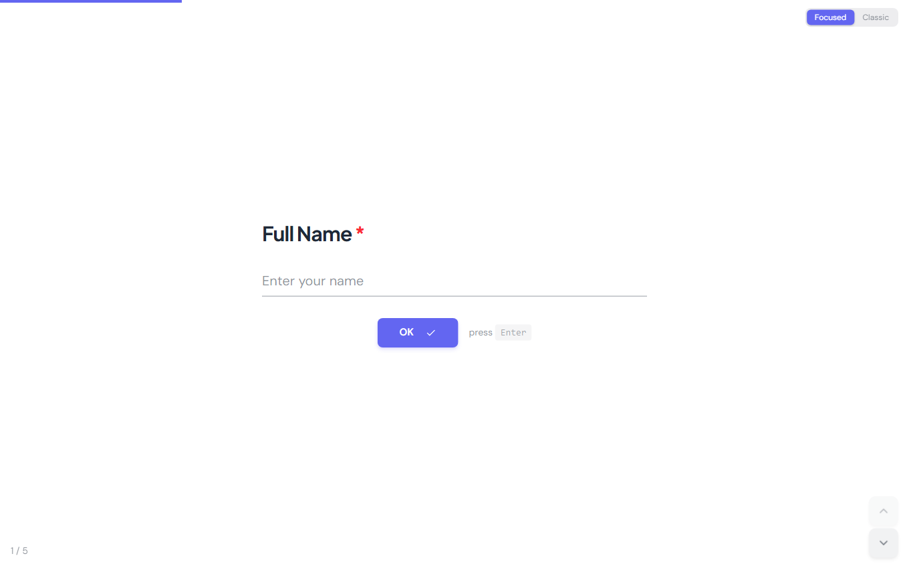
  &nbsp;
  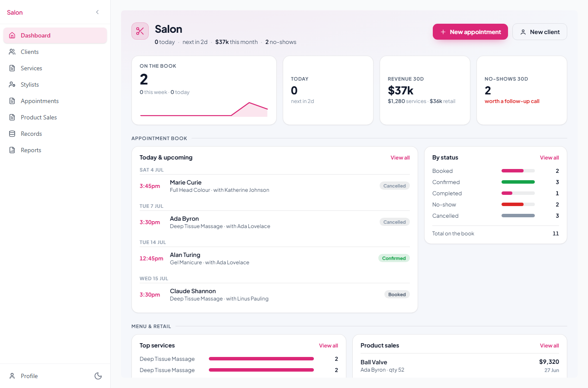
</p>
<p align="center">
  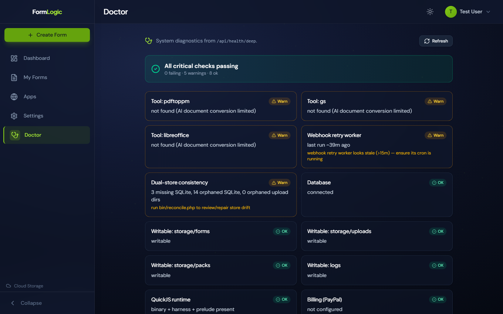
  &nbsp;
  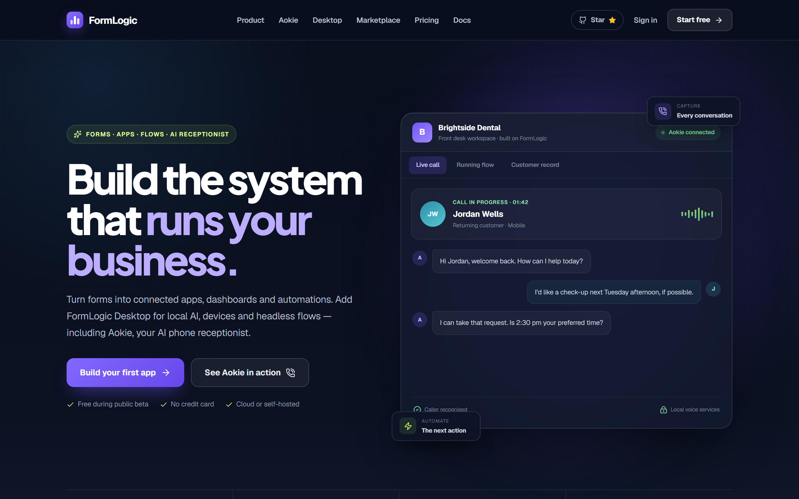
</p>

<p align="center"><sub>Form builder · public form (focused mode) · business app runtime · Doctor diagnostics · landing</sub></p>

## The idea, in plain words

1. **Forms** are the unit of data. Each form is a drag-and-drop schema (23 field types) with its own response database, validation, conditional logic, and an optional server-side `onSubmit` script.
2. **Apps** are forms composed into a product: navigation, members, roles with per-form permissions, linked records across forms, and a slug of their own (`/app/your-app`).
3. **Dashboards** make apps look like software, not paperwork: every app home screen and every form section is a no-code, drag-and-drop grid of chart/KPI/list widgets, plus a Reports section with exportable PDFs.
4. **Everywhere**: the same app installs as a PWA, runs on the owner's own domain with a branded launch page, or opens inside the FormLogic Native Runtime (a Tauri desktop/mobile shell) with device connectors and an offline queue.

Don't want to start from a blank canvas? Install one of the **29 marketplace apps** ([catalog below](#app-marketplace)) and customise it — or point your own AI at the built-in [MCP server](docs/MCP.md) and have it build the app for you.

## One backend, many portals

Apps are *windows onto shared data*, not silos. A form can be attached to any number of apps, and every app reads and writes the **same records** — so "client portal + staff app + admin console" is three apps over one set of forms, each with its own branding, members, roles, and dashboards. One click ("Create companion app") splits an admin console off an existing app.

```
   Client Portal          Staff App             Admin Console
   (own slug, users,      (own slug, users,     (companion app: every
    roles, branding,       roles, dashboards,    form attached, full-
    dashboards, domain)    reports)              visibility roles)
        │                      │                      │
        └──────────────┬───────┴──────────────────────┘
                       │   app_forms (many-to-many)
        ┌──────────────┴───────────────────┐
        │           SHARED FORMS           │
        │   Jobs   Clients   Invoices ...  │
        └──────────────┬───────────────────┘
                       │   form_id
        ┌──────────────┴───────────────────┐
        │         SHARED RESPONSES         │
        │   one SQLite database per form   │
        └──────────────────────────────────┘
```

Visibility is enforced server-side: a member's runtime payload contains only the forms their role can see, and dashboards/reports/navigation are stripped of anything else. The full model is in **[docs/ONE_BACKEND_MANY_PORTALS.md](docs/ONE_BACKEND_MANY_PORTALS.md)**.

---

## Quick start

### Requirements

| Requirement | Version |
|-------------|---------|
| PHP | 8.2+ with `pdo_mysql`, `pdo_sqlite`, `mbstring`, `json`, `openssl`, `fileinfo` |
| MySQL | 8.0+ |
| Node.js | 20.19+ or 22.12+ (required by Vite 7) |
| Composer | any recent |

No Node.js is needed on the *server* at runtime — the server-side script sandbox is a vendored static QuickJS binary.

### Assisted install (recommended)

Two installers live in `form-builder/`. Both create the `.env` files, generate security keys, and set up the database:

- **Web wizard** (WAMP / XAMPP / any PHP web server): serve the repo from your web root and open
  `http://localhost/<your-folder>/form-builder/install.php` in a browser. **Delete `install.php` when you're done.**
- **CLI** (Linux / macOS / Git Bash):

  ```bash
  cd form-builder
  chmod +x install.sh && ./install.sh
  ```

### Manual setup

```bash
git clone git@github.com:f2i-com/formlogic.com.git
cd formlogic.com

# 1. Create the database (the app creates the tables on first request)
mysql -u root -p -e "CREATE DATABASE formlogic CHARACTER SET utf8mb4 COLLATE utf8mb4_unicode_ci;"

# 2. Backend
cd form-builder/backend
composer install
cp .env.example .env
# Edit .env: set DB_USERNAME/DB_PASSWORD and a 32+ char JWT_SECRET
#   (generate one: php -r "echo bin2hex(random_bytes(32));")
composer start          # API at http://localhost:8080/api

# 3. Frontend (second terminal)
cd form-builder/ui
npm install
npm run dev             # app at http://localhost:5173
```

Open <http://localhost:5173> and create your account. Full developer instructions — production web-server configs, HTTPS notes, environment variables, tests, troubleshooting — are in **[form-builder/README.md](form-builder/README.md)**; the production launch checklist is **[DEPLOYMENT.md](DEPLOYMENT.md)**.

---

## Feature tour

### Form builder

A Typeform-style drag-and-drop editor with 23 field types (text, choices, rating, signature, file upload, location, linked record, calculated, hidden, …), live WYSIWYG preview, themes, form version history with restore, per-form analytics, webhooks with delivery tracking, and CSV/JSON/SQLite export. Forms work standalone — public link, embed, one-question-at-a-time mode — before any app exists.

### Real JavaScript, safely sandboxed

Conditional logic, validation, calculated fields, and post-submit `onSubmit` scripts are **real JavaScript** running in a [QuickJS](https://github.com/quickjs-ng/quickjs) sandbox — the same engine and standard-library prelude in the browser (WASM in a Web Worker) and on the server (vendored static `qjs` binary, no Node.js). The sandbox has no `eval`, DOM, filesystem, or network access; `onSubmit` scripts get a server-brokered, SSRF-guarded `ctx.http` and `ctx.db` for reading/writing the record. Built-in helper modules: `validators`, `format`, `compliance`, `finance`, `safety`.

### Apps, roles, and shared data

Compose forms into an app: pick forms, define roles with granular per-form permissions (submit / view own / view all / edit / delete / export), invite members, deploy at `/app/{slug}`. Linked-record fields reference other forms' responses, a relations map shows how forms connect, and an activity feed shows recent submissions across everything the member can see. Because forms are shareable across apps, one dataset can power several portals — and **Create companion app** clones the window (forms attached, theme, nav, optional dashboards/reports) without cloning the data.

### No-code widget dashboards and reports

Every app screen — the home dashboard and each form's section screen — is a drag-and-drop grid of chart widgets (KPI, bar, line, area, pie, donut, table, record list, activity feed) whose queries you edit inline, with one-click templates tuned to the kind of app you're building (admin console, client portal, staff app, …). The Reports section composes the same charts plus text blocks into documents and exports them as PDFs, including cross-form joins over linked records. No code runs in any of it — it's all declarative.

### Custom code, when you want it

Three escape hatches, each with a clear trust boundary:

- **App logic (QuickJS)** — sandboxed scripts on lifecycle hooks (`onScreenEnter`, `onBeforeSubmit`, `onConnectorEvent`, …) that describe *effects* (set values, toast, navigate, request connector data); the host applies effects only after permission checks, and the backend still re-validates every submission.
- **Custom screens** — sandboxed HTML/CSS/JS frontends (the iframe is the security boundary) over a form's or app's data via a postMessage SDK, with an in-app live-preview Studio and AI generation.
- **FormLogic SDK** — permission-aware React hooks and components for first-party, host-rendered screens.

The map of every custom-code surface is in [docs/CUSTOM_APP_PLATFORM.md](docs/CUSTOM_APP_PLATFORM.md).

### Marketplace and portable packages

Every app is portable. Export it as a **signed `.formlogic` package** — a ZIP with the app, forms, screens, dashboards, reports, QuickJS logic, and assets, Ed25519-signed so tampering is detected on import — or as a plain `.formlogic.json` pack. Imports are atomic (all-or-nothing), show a capability review first ("this app can: read vehicle status, set form values, …"), and carry a server-derived trust level (`official` / `community` / `unverified`). Publish packs to the built-in catalog with dynamic categories and tags. Format details: [docs/PACK_FORMAT.md](docs/PACK_FORMAT.md).

### Custom domains, PWA, and the native runtime

- **Custom domains** — connect `yourapp.com` to an app (DNS TXT verification), choose a branded launch page or straight-into-the-app mode, and get same-origin PWA manifests so it installs under your brand.
- **PWA** — the platform and every app are installable, offline-capable progressive web apps.
- **FormLogic Native Runtime** — a generic Tauri v2 desktop/mobile shell (Windows + Android built) that opens any FormLogic app via deep links (`formlogic://` or verified https App Links), verifies the app's Ed25519-signed client manifest before enabling native powers, and adds device connectors plus a disk-persisted offline queue. See [docs/NATIVE_RUNTIME_TAURI.md](docs/NATIVE_RUNTIME_TAURI.md).
- **Connectors** — apps ask for abstract commands (`vehicle status.read`, `device gps.read`, battery, network, clipboard, …) and never care about the transport; the same app logic works against the browser mock, the phone's Web APIs, or the native bridge.

### Bring your own AI (MCP) — or use the built-in one

- **Connect an AI**: FormLogic ships an MCP server (`POST /api/mcp`) so Claude, Cursor, or any MCP client can build and edit whole apps — forms, screens, reports, logic — using short-lived, scoped tokens that by default cannot read submission data. See [docs/MCP.md](docs/MCP.md).
- **Built-in AI generation**: generate forms and multi-form apps from a text prompt, a document, or an image, using any OpenAI-compatible provider — including keyless local servers (LM Studio, Ollama, vLLM). Optional; the platform works without it.
- **External REST API**: scoped API keys (`Authorization: Bearer flk_…`) give programmatic access; API submissions run the *full* pipeline including your `onSubmit` script. See [docs/API.md](docs/API.md).

### Flows, the Desktop, and an AI receptionist

- **FormLogic Flows** — visual, event-driven automations (`/flows`): triggers from form events, schedules, or device connectors, and a node executor (branching, loops, AI calls, connector commands, form reads/writes) that runs in the browser and headlessly on FormLogic Desktop. See [docs/FORMLOGIC_FLOWS.md](docs/FORMLOGIC_FLOWS.md).
- **FormLogic Desktop** — a desktop workspace (Tauri v2, `form-builder/desktop/`) that pairs with your account over OAuth, executes flows headlessly, and hosts local services — a llama.cpp LLM server and the Aokie Voice speech server — plus hardware connector plugins. See [docs/FORMLOGIC_DESKTOP.md](docs/FORMLOGIC_DESKTOP.md).
- **Aokie Receptionist** — the flagship pack: an AI phone receptionist that answers real phone calls on FormLogic Desktop with local speech-to-text, a local LLM, and text-to-speech. Live calls stream into the app's front-desk console; every call lands as records — calls with chat-style transcripts, customers, bookings, orders, and SMS threads — that your flows act on.

### Offline and sync

Forms can live locally in the browser (no account) or in the cloud, with change-aware sync and conflict prompts. Inside apps, submissions queue while offline and flush to an idempotent batch endpoint — from the browser, the PWA, or the native runtime's persisted queue — so nothing is lost or double-submitted.

### Security

HttpOnly JWT-signed session cookies, CSRF double-submit protection, per-endpoint rate limits (auth 10/min, submissions 30/min), SSRF-guarded webhooks and outbound probes, sandboxed user scripts with instruction/memory/time budgets, a hash-chained (HMAC-SHA256) audit log with integrity verification, signed packages and client manifests, and strict security headers.

---

## App marketplace

FormLogic ships a catalog of **29 ready-made vertical apps** — each a real working system (several linked forms, roles, seeded demo data, a configurable widget dashboard, reports), not a "Contact Us" form. Install one in a click, customise it, hand it to your AI, or export it as a `.formlogic` package. The no-signup **Live Demo** has the whole catalog pre-installed and populated — 32 demo apps across the 29 packs, since a few packs ship more than one portal (e.g. Finance OS ships onboarding *and* a transition hub).

<p align="center">
  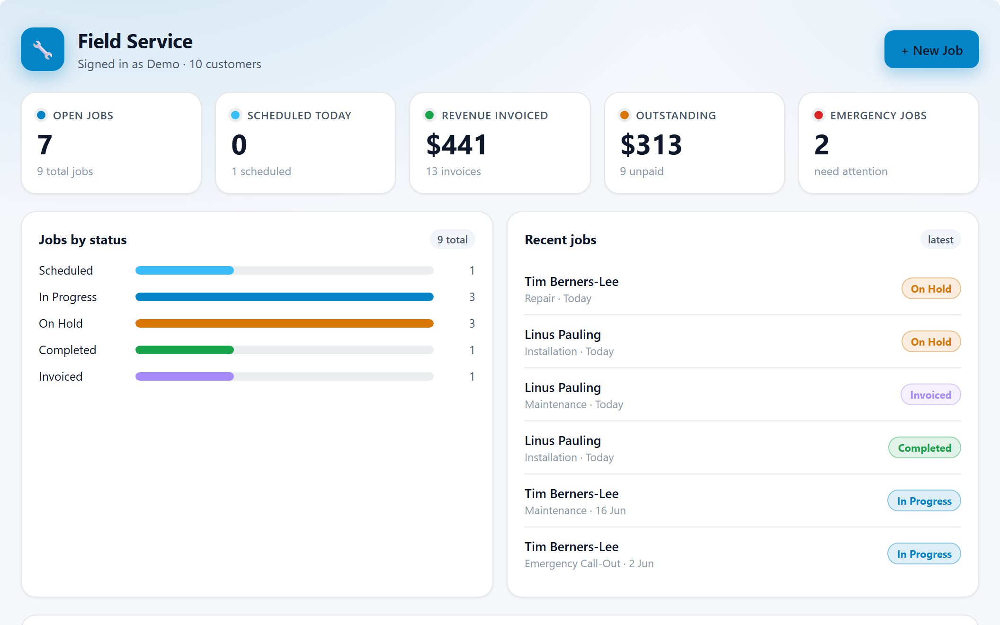
  &nbsp;
  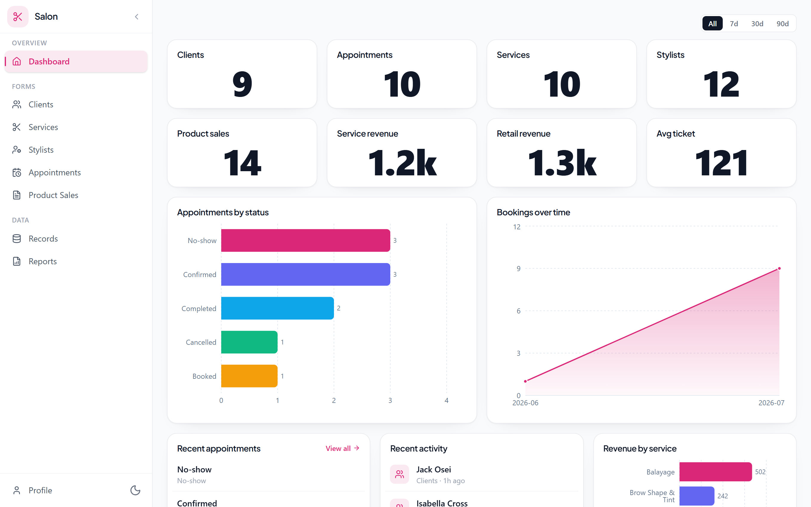
</p>
<p align="center">
  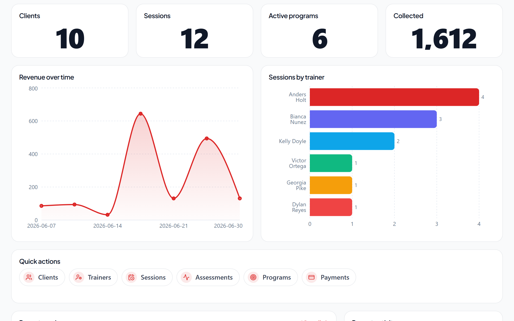
  &nbsp;
  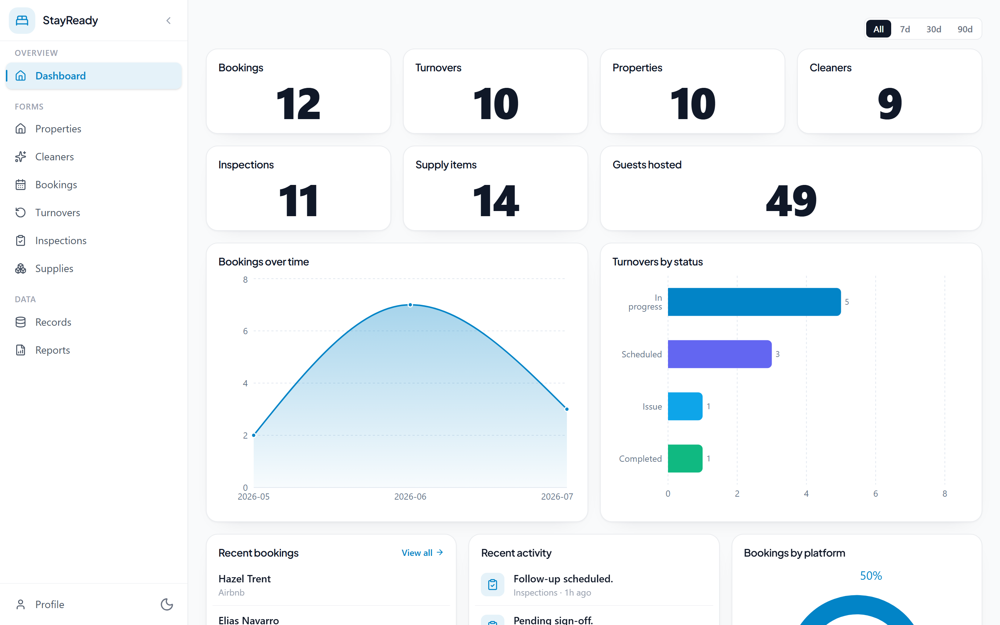
</p>
<p align="center">
  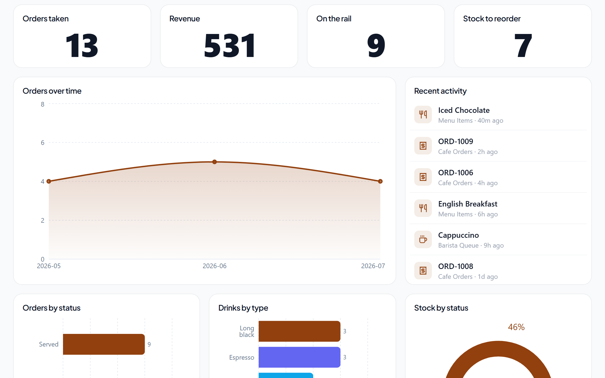
  &nbsp;
  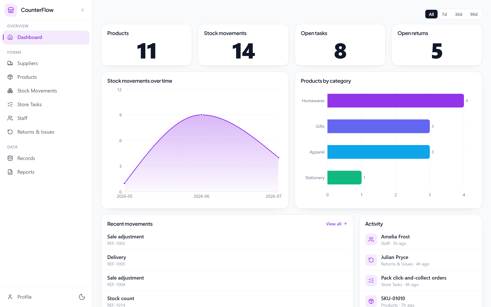
</p>
<p align="center">
  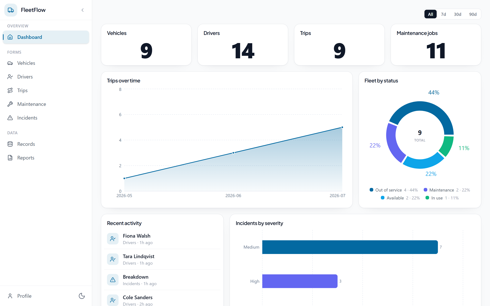
  &nbsp;
  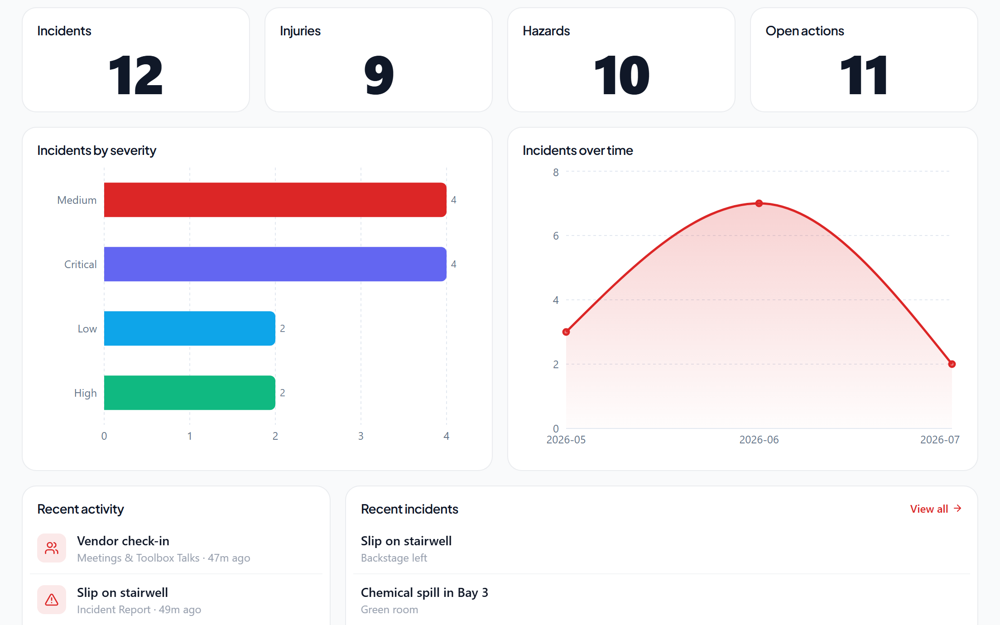
</p>
<p align="center"><sub>Eight of the marketplace apps — each thumbnail is the full app frame (navigation, forms, records, reports) around a no-code widget dashboard. Everything renders in light &amp; dark.</sub></p>

| App | Category | What it runs |
|-----|----------|--------------|
| Plumbing & Trades Field Service | Trades & Field Service | Customers → jobs → site visits → invoices → parts requests |
| Mechanic Workshop Manager | Trades & Field Service | Customers → vehicles → job cards → parts → invoices |
| Property Maintenance & Handyman | Trades & Field Service | Properties → tenants → requests → work orders → inspections |
| CleanShift — Cleaning Scheduler | Trades & Field Service | Clients → teams → jobs → quality checks → supplies → issues |
| PawRoute — Dog Walking & Pet Care | Trades & Field Service | Clients → pets → bookings → walks/visits → incidents & care notes |
| BrewDesk — Cafe & Barista Ops | Hospitality & Food | Orders → barista queue → menu → bean/milk stock → roster → daily close |
| GrillStack — Burger Command Center | Hospitality & Food | Order board → kitchen pass → prep → stock → shifts → daily close |
| PassMaster — Restaurant Service | Hospitality & Food | Reservations → tables → orders → kitchen tickets → prep → shift close |
| CaterCraft — Catering & Events | Hospitality & Food | Clients → menu packages → event pipeline → production → deliveries |
| StayReady — Short-Stay Turnover | Hospitality & Food | Properties → bookings → cleaner turnovers → inspections → supplies |
| Hair Salon & Beauty Studio | Beauty, Health & Fitness | Clients → services → stylists → appointments → product sales |
| FitStudio — Training & Coaching | Beauty, Health & Fitness | Clients → trainers → sessions → assessments → programs → payments |
| Clinic Appointment & Intake | Beauty, Health & Fitness | Patients → providers → appointments → intake → follow-ups (front-desk) |
| Inventory & Purchase Orders | Retail & Operations | Products → suppliers → purchase orders → line items → stock movements |
| CounterFlow — Retail Store Ops | Retail & Operations | Products → suppliers → stock movements → store tasks → staff → returns |
| FleetFlow — Fleet & Driver Log | Retail & Operations | Vehicles → drivers → trips → fuel → maintenance → incidents |
| OHS & Quality Management | Field Ops & Compliance | Incidents, hazards, audits, corrective actions, NCRs (ISO 45001 / 9001) |
| SitePulse — Construction Site Diary | Field Ops & Compliance | Projects → daily diaries → deliveries → defects → variations → insurances |
| AgriLog — Farm Jobs & Harvest | Field Ops & Compliance | Paddocks → crop jobs → harvests → chemical register → machinery |
| VenueOps — Venue Hire & Bookings | Bookings & Education | Spaces → hirers → bookings → setups → payments → incidents |
| TutorTrack — Tutoring & Lessons | Bookings & Education | Students → tutors → lessons → progress notes → invoices |
| Event Management | Bookings & Education | Registration, speakers, vendors, volunteers, incidents, budget, feedback |
| Job & Invoice Management | Billing & Business | Clients → jobs → quotes → invoices → payments |
| RepairBench — Device Repair Shop | Billing & Business | Customers → devices → repair jobs → parts → quality sign-off → pickup |
| HR & People Management | Billing & Business | Recruitment, onboarding, leave, reviews, expenses, training, exits |
| Customer Service | Billing & Business | Tickets, bugs, feature requests, feedback, refunds, escalations, KB |
| Finance OS (US) | Finance | RIA/broker-dealer onboarding, compliance & advisory (Reg BI, Form CRS) |
| Finance OS (AU) | Finance | AFSL advice, Best Interest Duty, super, AUSTRAC |
| Aokie Receptionist | AI & Voice | AI phone receptionist: live call console → call records with chat-style transcripts → customers → bookings, orders & SMS threads |

There are also bundled **sample apps** (Apps → "Try a sample app"): a CRM, an expense manager, people onboarding, the MineCab connector reference app, and a device-capability check.

---

## Under the hood

| Layer | Technology |
|-------|-----------|
| Backend | PHP 8.2+ / Slim 4, PHP-DI, Monolog |
| Data | MySQL (users, forms, apps, roles, audit) + one SQLite database per form (responses) |
| Frontend | React 19 + TypeScript, Vite 7, Tailwind CSS 4, Zustand 5, React Router 7, recharts |
| Scripting | QuickJS sandbox — `quickjs-emscripten` (WASM Web Worker) in the browser, vendored static `qjs` binary on the server |
| Native | Tauri v2 (Rust) shell in `form-builder/native-runtime/` |
| Auth | HttpOnly cookie sessions (JWT-signed) + scoped API keys + ephemeral MCP tokens |

```
formlogic.com/
├── DEPLOYMENT.md                  # Production launch checklist & operations
├── docs/                          # Design docs, API & MCP reference (below)
└── form-builder/
    ├── install.php / install.sh   # Assisted installers
    ├── backend/                   # PHP Slim API (public/index.php = routes)
    ├── ui/                        # React SPA (builder, app runtime, marketplace)
    ├── desktop/                   # FormLogic Desktop (Tauri v2): headless flows, local AI services, plugins
    └── native-runtime/            # Tauri v2 shell that opens any FormLogic app natively
```

## Documentation

| Doc | What's in it |
|-----|--------------|
| [form-builder/README.md](form-builder/README.md) | Developer setup: install, dev servers, tests, env vars, deployment configs |
| [DEPLOYMENT.md](DEPLOYMENT.md) | Production checklist, backups, webhook retry worker, health diagnostics |
| [docs/API.md](docs/API.md) | External REST API (API keys, scopes, full endpoint reference) |
| [docs/MCP.md](docs/MCP.md) | Connect your own AI over MCP: setup, scopes, tool list |
| [docs/PACK_FORMAT.md](docs/PACK_FORMAT.md) | The pack / `.formlogic` package format (v1) |
| [docs/ONE_BACKEND_MANY_PORTALS.md](docs/ONE_BACKEND_MANY_PORTALS.md) | The multi-portal model: shared forms, companion apps, appKind |
| [docs/CUSTOM_APP_PLATFORM.md](docs/CUSTOM_APP_PLATFORM.md) | App logic (QuickJS), SDK, connectors, signed packages, custom domains |
| [docs/NATIVE_RUNTIME_TAURI.md](docs/NATIVE_RUNTIME_TAURI.md) | The native runtime: bridge, deep links, manifest verification, offline queue |
| [docs/FORMLOGIC_FLOWS.md](docs/FORMLOGIC_FLOWS.md) | FormLogic Flows: triggers, node executor, bindings, desktop parity |
| [docs/FORMLOGIC_DESKTOP.md](docs/FORMLOGIC_DESKTOP.md) | FormLogic Desktop: account pairing, headless flows, local services, plugins |
| [docs/WIDGET_DASHBOARD_DESIGN.md](docs/WIDGET_DASHBOARD_DESIGN.md) | The no-code widget dashboard system |
| [docs/APP_SECTIONS_SPEC.md](docs/APP_SECTIONS_SPEC.md) | Per-form section screens |
| [docs/CUSTOM_APP_SPEC.md](docs/CUSTOM_APP_SPEC.md) | The master platform design spec |
| [docs/RELEASE_RUNBOOK.md](docs/RELEASE_RUNBOOK.md) | Pre-release checklist |

## License

FormLogic is **proprietary, source-available** software — it is *not* open source. In short (the [LICENSE](LICENSE) terms govern): you may self-host and use it for free for any purpose, including running your own for-profit business on it, and you may read and modify the source for your own use. You may **not** sell it, offer it as a paid product or hosted/managed service, or charge others to run it — those rights are reserved to FormLogic. For commercial licensing, see the contact note in [LICENSE](LICENSE).
