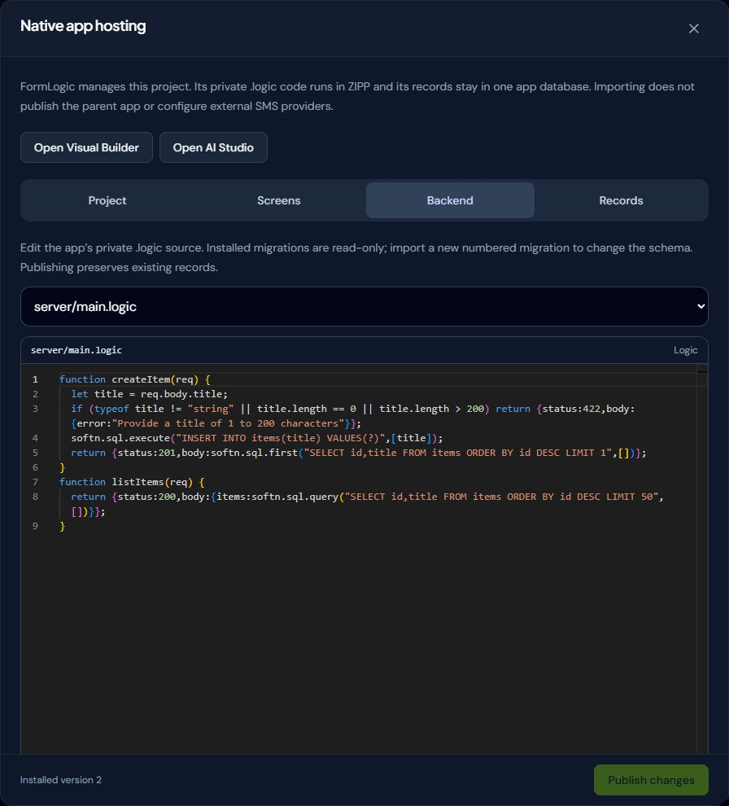
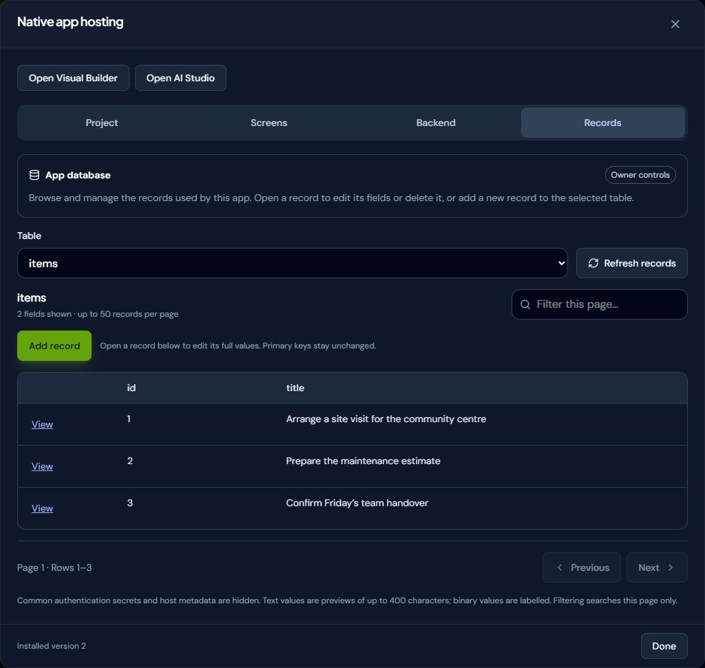
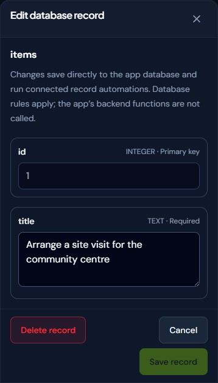

# Hosted apps and private backend actions

[Documentation home](../README.md) · [Connected dashboards and Aokie](CONNECTED_APPS.md) ·
[AI setup](FREE_PLANS_AND_AI_SETUP.md) · [MCP tools](MCP.md)

App Studio → Screens → **App hosting** hosts a text app bundle with private `.logic` actions and a separate SQLite database. The starter is a working team notes app. Edit the interface and actions, publish the project, then open Preview or `/app/<slug>/project`. Publishing a project does not change the parent app's publication status: members need an active membership and a published app. Owners can preview drafts.

## Choose the right starting point

| You want to… | Start here |
|---|---|
| Show an app's existing forms and records in an editable dashboard | **Screens → Create connected dashboard**; see [Connected apps](CONNECTED_APPS.md). |
| Add Aokie's calls, appointments and logs to an existing app | Share its forms through **Add from another app**, then use the Front desk route or Aokie dashboard template. |
| Build a custom interface with its own backend actions and database | **Screens → App hosting**; edit the starter or import a project. |
| Let an AI author the project | Use `get_app_project` and `publish_app_project` through [MCP](MCP.md#portable-projects-and-aokie-via-mcp). |

## Forms as portable app projects

**New form** accepts an optional name. A blank form starts as **Untitled Form** and
remains in your workspace until you delete it. Click its title in the form builder
to rename it, or use **Rename** from the Forms card menu or list view.

In the form builder, choose **More options → Download app project**. The `.softn`
archive includes a manifest, a main screen, and separate `.ui` and `.logic` files
for each form. Blank forms export as empty editable screens without sample fields.
To combine multiple forms, attach them to the same app and use App Studio's
**Create app project** panel to select the forms for one download with navigation.

The archive's `formlogic.modules.json` lists each reusable screen, logic file and
collection alias. Its README explains how to copy a customised module into another
app. Stable identities keep the generated module files consistent between a
single-form export and a combined app; re-exporting does not merge external edits.

FormLogic's form builder still saves its schema internally. The generated app is
an independent editable copy with local XDB records, not automatic synchronisation
with FormLogic responses. Unsupported fields and rules are called out before
download; encrypted forms, credentials and existing responses are excluded.
For authenticated backend actions and shared SQLite storage, use App hosting below.

### Publish your first project

1. Create or open the parent app, then open **App Studio → Screens → App hosting**.
2. On **Interface**, edit the `.ui`, `.logic` and `.json` client files, or use
   **Import project** for a compatible `.softn`, ZIP or `hosting-project.json`.
3. On **Backend**, define the action names called by the client. Give each action
   the required `owner`/`member` access and `read`/`write` database mode.
4. Choose **Publish app project**, then open **Preview**. The preview uses your
   authenticated session and the published database, so writes are real.
5. Publish the parent app and configure its member roles when it is ready for
   others. To make this project the home screen, use **Use as app home** in the
   connected dashboard panel. **Restore original home** switches back without
   deleting the hosted project.

Publishing again preserves records. If another editor has published a newer
version, refresh and merge their changes before retrying; do not discard the
version conflict by blindly replacing `expectedVersion`.

## Runtime and data boundaries

The hosted interface runs in a sandboxed iframe without same-origin access. The trusted FormLogic parent handles authentication and CSRF. Client code receives neither cookies nor tokens. The app's manifest cannot choose another app's database. Backend actions run in the existing ZIPP sandbox, with bounded record operations handled by PHP.

## Client `.logic`

Reference the entry logic from the interface: `<logic src="../logic/main.logic" />`. The app host supplies this callback API:

```javascript
let notes = [];
let message = "";
function _init() {
  softn.backend.call("listNotes", {}, function(response) {
    if (response.error) { message = response.error; return; }
    notes = response.result;
  });
}
```

Use `_init()` for initial asynchronous calls; event handlers use the same API. The name `softn` is the language namespace, not workspace product branding. An app opened in a host without a backend bridge receives an explicit error. A downloaded client does not contain credentials or a portable authenticated session.

## Private `.logic`

Each named action contains standalone source defining `onRequest(ctx)`, access (`owner` or `member`) and database mode (`read` or `write`). The source remains private. `member` grants every active member this action; scripts must enforce any finer record ownership rules using `ctx.user.id`. The starter deliberately shares its notes across members.

```javascript
function onRequest(ctx) {
  const text = String(ctx.input.text || "").trim();
  if (!text || text.length > 2000) {
    return {reject:true, message:"Write a note of 1–2,000 characters."};
  }
  return ctx.db.put("notes", ctx.requestId, {
    text:text,
    author:ctx.user.id
  });
}
```

`ctx.input` is the JSON request; `ctx.user` contains server-resolved `id` and `isOwner`. `ctx.requestId` is a new random ID for the invocation. It is not an idempotency key: use an application-supplied stable record ID for idempotent writes.

| Method | Result |
| --- | --- |
| `ctx.db.get(collection, id)` | Record data or `null` |
| `ctx.db.list(collection, limit, offset)` | `{id, data, updatedAt}[]`, newest updates first |
| `ctx.db.put(collection, id, data)` | Upsert and return `{id}` |
| `ctx.db.remove(collection, id)` | `{removed: boolean}` |

These are parameterized operations over a real SQLite `records` table. This named-action format does not expose arbitrary SQL, migrations, filesystem access, HTTP calls, or the separate native private-server manifest dialect. Native server projects use the separate import path below. Collections are app-wide. Existing form response databases are separate; importing a local form bundle does not migrate its records or automatically connect its submissions. Local XDB inside the isolated preview is temporary; connect persistent forms to backend actions.

Every action runs in a transaction. Script errors, rejection, read-only violations, host-operation errors (even if caught by the script), and oversized results roll back writes. Publish validates action declarations in a pure sandbox before changing the deployment. An optimistic version check rejects overwriting a newer deployment with HTTP 409. Republish preserves the database.

## HTTP API

The routes use existing FormLogic session/JWT authentication. Cookie-authenticated writes require the existing CSRF header. The authenticated user's identity and membership are checked on every request. A public manifest or an app ID alone grants no access.

| Route | Access / body |
| --- | --- |
| `GET /api/apps/{id}/hosting` | Owner; private source, version, record count |
| `PUT /api/apps/{id}/hosting` | Owner; `{expectedVersion, package}` |
| `GET /api/apps/{id}/hosting/database` | Owner; consistent SQLite snapshot, including private actions |
| `GET /api/app/{slug}/hosting` | Owner / active member; client files only |
| `POST /api/app/{slug}/actions/{action}` | Action's access rule; JSON object input; returns `{result}` |

The package is `{version:1, client:{"manifest.json":"…","ui/main.ui":"…"}, actions:{name:{source,access,mode}}}`. The editor imports client `.softn`/ZIP bundles or full `hosting-project.json` files. Client-only imports retain existing private actions for review. Public manifest metadata and permissions are rebuilt server-side; private directories and executable HTML/JavaScript files are rejected.

For a first publication, send `expectedVersion: 0`; subsequent publications use
the current deployment version returned by the owner GET. A deployment version
is separate from the package format's fixed `version: 1`.

The MCP equivalent is `get_app_project {appId}` followed by
`publish_app_project {appId, expectedVersion, package}`. Reading requires
`apps:read` and includes private backend source; publishing requires both
`apps:write` and `screens:write`. Token app confinement and owner checks apply.
`update_app {appId, hostedDashboard: true}` makes an already published project
the app home; `status: "published"` controls the parent app separately.

Limits: 2 MB package, 100 text client files (200 KB each), 30 actions (50 KB source each), 32 KB action input, 50 host calls, 256 KB result, 100 records / 200 KB per page, 16 KB per record, 10,000 records per app. The SQLite file has a 32,768-page cap (normally 128 MiB); busy waits stop after two seconds. The guest has the existing sandbox instruction and CPU limits. Hosting requests are rate limited and deployment/action writes use the existing cloud write gate. The shared demo cannot use hosting.

## Build and operate

Install the FormLogic UI dependencies, then:

```powershell
# From formlogic.com/formlogic/ui
node ../../scripts/fetch-softn-release.mjs
npm run test:zipp-sharing
npm run build
```

The first command takes Softn's latest GitHub release (`softn-formlogic-runtime-<tag>.zip`), checks the archive against its `.sha256` and its own manifest, checks that every copy of the ZIPP engine in it is the one ZIPP release it records and that it speaks the same protocol versions, then replaces `vendor/zipp-wasm` (the browser engine), `public/hosted-runtime`, `public/app-editors` and `backend/resources/softn-native` with the verified contents. A complete asset manifest detects missing, modified or obsolete files. These generated files are ignored by Git; preserve the entire artifact, including `runtime-manifest.json`, if frontend deployment runs elsewhere. A normal UI build rejects a missing or mismatched runtime. Deploy the parent UI and hosted runtime together. The runtime is excluded from the main PWA precache and SPA fallback. To build from a Softn source checkout instead (Softn development), run `npm run fetch:zipp` in the checkout, then set `SOFTN_REPO` and run `node scripts/sync-zipp-from-softn.mjs` from the repository root before `npm run build:hosted-runtime` and `npm run build:app-editors` (the builders refuse a missing engine tree); see [Updating the shared engine locally](#updating-the-shared-engine-locally) and [ecosystem/SOFTN_RELEASE.md](ecosystem/SOFTN_RELEASE.md).

Both browser integrations use the same ZIPP engine: the JavaScript/Python (`web-python`) artifact of the ZIPP release the installed Softn release was built with, which Softn verified against that ZIPP release's `SHA256SUMS`. FormLogic names no ZIPP version itself; the installed release, its commit and checksums are recorded in the generated `formlogic/ui/vendor/zipp-wasm/SOURCE.json`. FormLogic downloads and verifies the binary lazily once per page, then passes cloned bytes to its expression worker and each hosted Softn app. Each context keeps its own WASM instance, memory and permissions. Failed downloads can retry; worker restarts, additional apps and source replacements reuse the cached bytes. The shell announces its version and hash before initialization, so a stale shell displays an update error rather than running mismatched glue. The browser check covers both loading orders, concurrent startup, separate app state, backend actions, source replacement and download recovery using only local fixture data.

Hosted apps use main-thread script execution. The iframe's existing opaque origin and `worker-src blob:` policy do not permit Softn's additional URL-based sandbox workers; sharing engine bytes does not change those capabilities.

Serve `/hosted-runtime/` static assets with `Access-Control-Allow-Origin: *` and `X-Content-Type-Options: nosniff`; the opaque iframe needs anonymous CORS access to its trusted JS/WASM. An Apache `.htaccess` is included; equivalent headers must be configured for Nginx or another host. The runtime entry document (`/hosted-runtime/index.html`) and the embedded editor entry documents (`/app-editors/builder/index.html` and `/app-editors/studio/index.html`) must also send `Content-Security-Policy: frame-ancestors 'self'; base-uri 'self'; object-src 'none'` and `X-Frame-Options: SAMEORIGIN`. The web-root `.htaccess` scopes these exceptions to the embedded documents; keep the dashboard's default framing denial. If a proxy or CDN injects another `frame-ancestors 'none'` or `X-Frame-Options: DENY` on these paths, remove that conflicting override for the embedded documents. Do not add permissive CORS to authenticated API routes. Vite development has a middleware limited to the static runtime directory.

PHP needs the existing sandbox binaries, PDO SQLite, and writable `backend/storage/hosted-apps` outside the public document root. No new MySQL migration or Node process is needed on the API server. Deploy the new PHP classes and route wiring with the frontend assets.

## Export and back up

| Action | Includes | Purpose |
|---|---|---|
| **Download client** | Public interface files | Edit or reuse the Softn client; live backend access still requires a compatible authenticated host. |
| **Save project copy** | Client and private action source | Restore or continue editing the project; no stored records are included. |
| **Download database** | SQLite deployment and records, including private actions | Owner backup of the hosted project and its data. |

The hosting database file is `storage/hosted-apps/<sha256(appId)>.sqlite`. It contains both the deployment and records. **Download database** produces a transaction-consistent snapshot; **Save project copy** includes private backend code but no records; **Download client** includes only public interface files. Existing account/form backup exports do not yet include hosted databases. Include this directory in operator backups; use SQLite backup/VACUUM snapshots or stop writes while copying. Retain the server-owned app ID when restoring a database. Deleting/recreating an app does not automatically remap this storage.

## Troubleshooting

| Symptom | Check |
|---|---|
| Preview is missing or returns 404 | Publish the project first; verify the generated `/hosted-runtime/` assets are deployed and served with the documented static CORS headers. |
| Owner can open it but a member cannot | Publish the parent app and verify the member is active. Check each action's owner/member access rule. |
| Imported form data is missing | Client imports contain source, not records. Existing FormLogic responses use the workspace bridge; custom hosted collections use `ctx.db`. |
| Publishing returns 409 | Another publication changed the deployment version. Read the latest project and merge before publishing. |
| A write appears to fail silently | Check the client callback's `error`; validation, rejected actions and host errors roll back the whole transaction. |

This hosting format accepts text clients and the action API documented here.
Locally generated forms need an explicit backend connection. Native private-server packages use **Native app hosting** below. Neither import migrates existing databases or credentials.

### Clean release builds

The CI, E2E and Package workflows use the shared
[prepare-hosted-runtime action](../.github/actions/prepare-hosted-runtime/action.yml), which
runs `scripts/fetch-softn-release.mjs`: the latest Softn release's runtime archive, verified and
installed, with no Softn checkout or build. To reproduce a run locally, run the same script
(`SOFTN_RELEASE=<tag>` for the release a run used; the tag is in the run log and in
`.runtime-source/softn-release/current.json`). A Softn release built with a new ZIPP release
installs with no FormLogic change: its `zipp/` tree becomes `formlogic/ui/vendor/zipp-wasm`.
A release with another protocol version, an engine copy that is not the recorded ZIPP release,
or no `zipp/` tree at all (Softn before v0.0.15) is refused by the fetch with a message naming both sides.

The release ZIP includes `api/storage/hosted-apps/`. The installer creates and checks this private
SQLite directory alongside other storage, and authenticated deep health reports missing or
unwritable hosted-app storage. Back up its contents and preserve them during upgrades.

### Follow-up performance and retry work

Hosted actions currently reserve a write transaction with `BEGIN IMMEDIATE`, including reads,
with a two-second SQLite busy timeout. Read/write concurrency at 1, 5, 10 and 25 callers should
be benchmarked before changing this transaction policy. Record latency percentiles, busy errors
and rollbacks. A read-only transaction change must preserve enforcement of action modes.

`ctx.requestId` identifies an invocation; it is not stable across retries. Before adding automatic
write retries, design explicit client operation IDs and duplicate-result handling for bookings
and other record creation. Do not treat request IDs as idempotency keys.

## Native app hosting (local preview)

Use **App Studio → Screens → Hosting & app tools → Native app hosting** for an existing
`.softn` project with a `server` manifest, private `.logic` handlers and numbered SQLite
migrations. This is separate from the named-action editor described above.

1. Import the `.softn` file (or a ZIP containing exactly one app). Review its route count
   and files before installing. The imported project is an unsaved draft.
2. Choose **Use the app’s own sign-in** to keep an existing account system, such as
   Coffee.Dating's phone-code sign-in. Choose **Require FormLogic membership** for apps
   that should use FormLogic registration/invitations. Configure these in **Users & roles**.
3. Optionally enable **Use this app as the website home**. The regular `/app/<slug>`
   address then opens this interface. A verified custom domain in **Open the app directly**
   mode uses that same entry point. DNS, the web server hostname and HTTPS still need
   operator configuration; local development does not provision a public domain.
4. **Install app project** validates the backend in ZIPP and applies its declared migrations.
   **Screens** edits the public interface/client source. **Backend** edits private `.logic`;
   both source editors include syntax colours, line numbers, search, wrapping, and light/dark themes.
   Existing migrations remain read-only. Import a new numbered migration to evolve the schema.
5. **Records** lets the owner browse, create, edit, and delete records in the app's SQLite tables.
   The list paginates 50 rows and previews 400 characters per text cell. **View → Edit record**
   loads full values (up to 100 KB per field); primary keys, generated fields, and binary values
   stay read-only. Common authentication secrets and host metadata remain hidden. Tables need
   a visible primary key for editing/deletion; creation requiring private or binary fields goes
   through the app. Defaults and NULL are separate from empty text. Stale edits are rejected.
   These owner controls apply database constraints and connected record automations, but do
   **not** call the app's backend functions. Use the app itself when its business validation is required.
   Deletion requires confirmation and honours database relationships, including cascades.
6. **Download editable project** includes the current draft's source, media and migrations.
   It does not contain database records or operator credentials.
7. **Open Visual Builder** edits layout and components directly in FormLogic. **Open AI Studio**
   opens the source/AI editor, including its mobile layout. Studio uses the AI source selected
   in FormLogic Settings → AI (OAIY, your own API, or site AI when enabled); no provider key is
   copied into the editor. Use **Review changes** to return the draft, inspect its files, then
   **Publish changes** to update the hosted app. The version check protects newer edits and
   existing database records are preserved. Editor previews show the interface; publish and
   open the app in FormLogic to test its hosted backend. Builder is designed for larger screens;
   use Studio on a phone. Both editors retain private backend files in the owner draft.

Installing a native project does not publish the parent FormLogic app. Owners can preview
its draft at `/app/<slug>/native`; other visitors require the parent to be published.
FormLogic project administration is owner-scoped and separate from the app's own accounts.
In membership mode, active members pass the FormLogic gate and handlers receive trusted
`req.context.formlogic` with `appId`, `userId` and `roleId` (`owner` for the project owner).
Use `userId` in parameterized SQL when rows belong to individual members. In application
mode, this context is absent and the app implements its own sessions and authorization.

### Native runtime and request bridge

Private code runs in the safe-sandbox ZIPP WASM VM through SoftN's trusted Node host, using
`softn.sql`, `softn.crypto` and `softn.time`. Top-level source declares functions and data;
perform host operations inside request handlers so declaration validation can run before
migrations. The operator supplies the runtime; uploaded
projects cannot supply Node modules, provider hooks or a different VM. The parent routes
`softn.net.fetch` calls for the current origin and `manifest.config.server.allowedOrigins`
to the installed app's `/api/...` handlers. It preserves the application's bearer header
inside this bridge; it never forwards the FormLogic account credential as an app token.
These origins are routing aliases, not permission to make arbitrary external requests.

Native browser storage is scoped to the selected app (256 KB total, 200 keys), including
session persistence across reloads. A failed persistence acknowledgement is shown in the
app. The opaque iframe still has no direct access to FormLogic's cookies or browser storage.
The parent supplies the same verified ZIPP bytes used by the hosted client; the server's
separate VM process does not cause another browser WASM download.

Owner APIs are `GET/PUT /api/apps/{id}/native` and
`GET /api/apps/{id}/native/records?table=...&offset=...`. PUT includes `project` and
`expectedVersion`. Runtime APIs are `GET /api/app/{slug}/entry`,
`GET /api/app/{slug}/native`, and `POST /api/app/{slug}/native/request`.
The last accepts `{method,path,query,headers,body}` and returns `{result:{status,body}}`.
The service limits decoded project content to 16 MB; source files to 1 MB each; source/media
counts to 200/100. The browser action bridge currently limits an individual message to 32 KB.
At most four native workers run concurrently across apps in one storage root, with a 20-second
worker deadline. This is an initial capacity limit, not a production concurrency benchmark.

### Source and records walkthrough

The following screenshots show the current local interface with a fictional Service desk project.



Use **Screens** for `.ui` interfaces and their client logic. Use **Backend** for private `.logic`
handlers. Both editors have line numbers, word wrapping, search (`Ctrl/Cmd+F`) and light/dark
colours. Edits stay in a draft until publication. Existing SQL migrations are read-only; add
new numbered migrations when changing the schema.



Choose a table, then **Add record** or **View → Edit record**. Automatic IDs and database
defaults can be left unset. NULL and empty text are separate choices. Saving uses the full
record, not its shortened list preview. Close and refresh a record if a conflict is reported.
Deletion requires confirmation and honours foreign-key rules, including cascades.



### Owner record API

These session-authenticated endpoints are for the FormLogic project owner, separate from
visitor accounts inside the hosted application. POST requests require the session's CSRF
header. The shared demo can browse a native project and its records read-only: its reads skip
the runtime preflight and answer `readOnly: true`, its writes (install, record actions) are
refused with `403` `demo_readonly`, and its installed app does not run. Record requests have
their own limit of 30 per minute per account, separate from app publication requests; the demo
account's reads are counted per account and client IP, since every demo visitor shares it.

| Request | Result |
|---|---|
| `GET /api/apps/{id}/native/records` | Available application tables. |
| `GET /api/apps/{id}/native/records?table=items&offset=0` | Up to 50 previews, the effective `offset`, `limit`, `offsetLimit`, `end` (`more`/`limit`/`end`) and `hasMore`, schema/field metadata, and `keys` aligned to the returned rows. |
| `POST /api/apps/{id}/native/records` | Read a full record, create, update or delete using the action body below. |

```json
{"action":"read","table":"items","key":{"id":"1"}}
```

Read returns `record.values`, `record.fields` and `record.revision`. Keep the revision for
the next update or delete. Use the `keys` from the list response rather than deriving IDs
from shortened previews. Key values and editable numeric values are returned as strings
so large SQLite integers are preserved.

```json
{"action":"create","table":"items","values":{"title":"Arrange a site visit"}}
```

Omit a field to use its database default. Supply JSON `null` explicitly for NULL.

```json
{"action":"update","table":"items","key":{"id":"1"},"revision":"<revision from read>","values":{"title":"Confirm the site visit"}}
```

Only send changed, editable fields. Primary keys remain unchanged. Generated and binary
fields are read-only; secret columns and internal host tables are excluded. Text over
100 KB is not returned as editable content. A complete visible primary key is required to
edit/delete, and tables needing required private/binary values must be populated through
the app. Database constraints are enforced inside the write transaction. Stale or missing
records return 409; database constraint failures return 422. Successful mutations return
`{"saved":true}` and queue enabled record automations with the committed write.

```json
{"action":"delete","table":"items","key":{"id":"1"},"revision":"<revision from read>"}
```

The API does not present a confirmation dialog: integrations must obtain the intended
user action before requesting deletion. As in the UI, owner writes bypass the app's backend
functions. They are maintenance operations, not a replacement for application validation.

### Record changes and signup flows

Open **App Studio → Automations → Connect database event**. Choose a SQLite table,
whether a record is created, updated or deleted, and an existing flow. Enable the flow
when ready. For an app that inserts accounts into `users` after verifying its own sign-in,
select **users → Record created**. If the app creates provisional users earlier, use its
actual registration table/change and a trigger condition that reflects completed signup.

The **Data & forms** tab lists the native SQLite tables alongside optional FormLogic forms.
Search the table list and click a table to open its records. The same backend and database
are also available in **Data & forms → Records → Backend code / Database records**, as well
as Screens' hosting tools. Backend edits publish a new source
version while preserving records. The database viewer has desktop tables, mobile record cards, expandable details, refresh,
50-row pagination and a filter limited to the current page. **Add record** creates an entry;
**View → Edit record** loads its full editable values and provides save/delete controls.
Owner maintenance applies database constraints and connected automations. It does not call
the app’s `.logic` validation functions; use the app itself when those rules are required.

The trigger picker creates an ordinary app flow binding. API/MCP clients can configure it
with `POST /api/apps/{id}/flow-bindings`:

```json
{
  "event": "app.record.created.users",
  "flow": "welcome-user",
  "mode": "async",
  "enabled": true,
  "inputMap": {
    "record": "$event.data.record",
    "table": "$event.data.table",
    "operation": "$event.data.operation"
  }
}
```

Use `app.record.updated.TABLE` or `app.record.deleted.TABLE` for other changes. Table names
must be simple identifiers, at most 63 characters. Events contain `appId`, `eventId`,
`table`, `operation`, `record`, and `recordPreview:true`. Created/updated events contain the
new row; deleted events contain the old row. Previews include up to 40 non-secret columns,
with text shortened to 400 characters and binary values omitted. Oversized encoded flow
snapshots use an empty record and `recordTruncated:true`. Do not treat a preview as a full
database export. Add conditions and change input mapping in the flow's Triggers panel.

The trusted host captures changes inside the same SQLite transaction as the application
write. Rolled-back writes do not emit events. Migrations and existing records do not replay
as signups. Only enabled bindings on enabled flows capture changes; manual bindings do not.
Pending events retain the binding IDs present at write time. Disabled/deleted targets are
skipped on delivery. A durable private outbox retries failed queue delivery; idempotency
keys prevent duplicate queue entries. This does not guarantee exactly-once external side
effects inside a flow. At 10,000 pending events, new subscribed writes stop until delivery
recovers instead of silently discarding events.

Events normally enqueue inline after commit. Run the recovery command every minute, or
under a process supervisor with `--watch`:

```sh
cd formlogic/backend
php bin/native-record-dispatch.php
```

This command delivers to the flow queue; it does not execute flow steps. Keep a connected
OAIY executor online for unattended execution, or open the authenticated FormLogic member
runtime. An app using its own sign-in does not grant that visitor FormLogic flow execution
permissions. Use Run history to distinguish queued work from completed work. Native event
support requires the prepared host's `recordEvents:1` protocol capability.

### Preparing the optional native runtime

The local preview requires PHP 8.2+, PDO SQLite, `proc_open` and Node 24.19+ with `node:sqlite`
and its authorizer API. Set `FORMLOGIC_NODE_BIN` to the absolute Node executable in the backend
operator environment. From the FormLogic repository root, run:

```sh
node scripts/fetch-softn-release.mjs
cd formlogic/ui
npm run build
```

The fetch script installs the native runtime together with the browser runtime and editors
from the latest Softn release, and refuses a release whose native host protocol is not the 1
this FormLogic speaks or whose ZIPP artifact differs from FormLogic's vendored identity.
Generated server assets go in `backend/resources/softn-native/`; the browser runtime goes
in `ui/public/hosted-runtime/`. An older browser runtime is rejected with an update message.
The shared release preparation action installs all three the same way. The package script
checks these artifacts before staging a release. Source installations must install them
explicitly (from a Softn source checkout: `SOFTN_REPO=... node scripts/prepare-native-runtime.mjs`). A host without compatible
Node or native modules reports native hosting unavailable; the frontend also checks editor assets.

Persistent app data is under `backend/storage/native-apps/<sha256(appId)>/private/`, outside
the public document root. Back up this whole installation with SQLite-consistent snapshots,
including `config.json`: its private encryption key is required for the app's existing data.
Account/form export jobs do not yet include this directory. Installed source and project
metadata sit alongside it.

#### How an update is applied, and what happens when it is interrupted

An update holds the exclusive management lock and works through fixed phases, each recorded
in `private/install.json` (the install journal) before the phase's work begins:

| Phase | What has changed on disk |
| --- | --- |
| `staged` | The new source and media are staged beside the installation; nothing active has changed. The journal already names every file the update may create. A first install creates `private/config.json` in this phase. |
| `config-changed` | `private/config.json` carries the new capability list; the previous file is kept as `config.previous-<op>.json` and the previous `project.json` as `project.previous-<op>.json`. The pre-install snapshot is taken and checked in this phase. |
| `activating` | A verified pre-install snapshot (`pre-install-<op>.sqlite`) exists when there was a database; the source swap is about to happen. |
| `source-activated` | The new source is in `app/`; the previous source is in `previous-<version>-<op>/`. |
| `migrated` | The runtime validated the manifest and applied migrations against the real database; `project.json` is being replaced. |
| `metadata-promoted` | `project.json` names the new version: the new generation is complete. |

The journal is removed when the update is complete. If the PHP process is terminated at any
point, the journal stays behind, and the next operation to touch the installation (a request,
the records browser, a backup, event delivery, or another update) settles it under the lock
before doing anything else: a journal at `metadata-promoted` is rolled forward (snapshots,
backups and the older source retired); any earlier phase is rolled back, restoring the previous
source, the database from its verified snapshot, the previous configuration and the previous
`project.json`, then deleting every snapshot and backup the journal names. A first install that
did not finish is rolled back to nothing (its fresh database, configuration and `project.json`
are removed) and can simply be retried. Every rollback step is checked. If one cannot complete,
the journal is kept in phase `recovery`, `private/recovery-required` names what is unfinished,
and every input the operator needs (the staged source, the previous source, the snapshot, the
configuration and project backups) is retained. A journal that reads but cannot be decoded is
treated the same way (one that momentarily cannot be read at all only answers busy). While the
journal is in `recovery`, runtime, records, backups, event delivery, updates and restores refuse
as needing operator recovery rather than as an update in progress, and nothing the journal names
is overwritten or cleaned up. On the owner's routes (project, install, records) that refusal is
a `503` with code `recovery_required` and the recovery text, server locations replaced by
labels relative to the installation; visitors of the app runtime and the shared demo get the
generic `503` "native app host is unavailable". The full text also goes to the PHP error log
and `private/recovery-required`. A request that races another reader for the lock may still get
a busy `409`, and the app runtime answers `409` while an update holds the lock, since it reads
the project under the lock rather than serving a `project.json` an unfinished update left.

The recovery is finished only when the operator has put the installation back together by hand
(using the inputs listed in `private/install.json`) and removed **both** `private/install.json`
and `private/recovery-required`. Removing only the marker does not unblock the app: the next
operation finds the journal still in `recovery` and writes the marker again.

Every file the host publishes (`project.json`, `config.json`, staged source and media, the
journal, the marker) is written completely or not at all: to a private temporary file beside
the destination, with the byte count checked against the bytes intended, flushed, then renamed
into place. A short write (a full disk, a quota) fails the update and leaves the previous file.

Every entry point takes the management lock before deciding anything: whether the installation
exists, whether an update was left unfinished, whether recovery is required, and — for app
requests — that the generation the access decision was made against is still the one
installed (otherwise `409`, and the client reloads).

Owner-authorized project updates refresh the host's supported capability list while retaining its
identity, encryption key and crypto domains. One previous source version is retained after a
successful update; staging directories are discarded.

#### Records browsing window

The Records view reads pages of 50 rows in primary-key order, and a page may start no further
than offset 100,000 (a bounded browser, not a full-table scan). Every response says which
offset it actually used (`offset`), the page size (`limit`), the window (`offsetLimit`) and
why it stops: `end` is `more` (a next page exists inside the window), `limit` (rows exist
beyond the window) or `end` (the last page). A requested offset past the window is clamped
and reported, never silently repeated under a new page number; `hasMore` is true only for
`more`.

### Coffee.Dating validation and remaining integrations

The local review imports Coffee.Dating Cafe 0.5.0, preserves its 37 routes and 3 migrations,
and exposes its 28 real tables in Records. Its café interface renders on desktop and mobile,
and app-scoped browser storage survives reloads. A separate native notes app tests an actual
browser → FormLogic → ZIPP → SQLite write and trusted membership identity.

Coffee.Dating's original source/archive and production records remain untouched. Its own
phone-code login is preserved, but real sign-in still needs an operator SMS delivery adapter
and credentials. Development codes are disabled. Photo upload processing is not connected;
`/api/meta` reports `photos:false`. No live SMS, photos, dating accounts or public domain were
created by these checks. Native database export/restore UI and production load testing remain follow-up work.


### AI creation and embedded editor installation

Chat and MCP share native app tools. Call `create_app`, then `get_native_app_template`;
customize its `project` and call `publish_native_app_project` with `expectedVersion: 0`.
Read `get_native_app_project` before updates (use `file` for one source file), then use
`update_native_app_files` with the current version. `list_native_app_records` lists tables
or a paginated table. Owner/app scope and apps/screens write permissions still apply.
Installing a project does not publish the parent app to visitors; use the publish step.

The editor assets come with the Softn release `node scripts/fetch-softn-release.mjs`
installs (`public/app-editors/{builder,studio}` with the editor bridge protocol in its
`manifest.json`); deploy that directory with the UI. To build them from a Softn source
checkout instead, set `SOFTN_REPO` in `formlogic/ui`, install the Softn workspace
dependencies, build its shared packages, then run `npm run build:app-editors` before
`npm run build`. Generated editor assets are ignored by Git and excluded from the FormLogic
PWA precache. The shared release preparation action installs all three artifacts (hosted
runtime, embedded editors and native backend runtime) from the release. The UI prebuild checks
editor manifests and asset hashes; packaging repeats those checks and validates native runtime
modules. Missing assets or a mixed ZIPP version stop the build. Local development uses the
checked-out sources; both repositories' matching commits must be pushed before running the
remote package workflow. No workflow is started by this local preparation.


### Editing checks and draft safety

Studio cannot return a draft while an AI turn is generating. Wait for completion, or use
Stop generating before Review changes. Cancelling a request releases the FormLogic bridge
for the next turn and late replies do not change the draft. Closing an unpublished hosting
draft asks before discarding it. Existing version checks still apply when publishing.

The local integration suite (`ui/e2e/app-editors.spec.ts`) covers canvas property edits,
AI cancellation/retry with a deterministic provider response, mobile chat, publishing and
a subsequent real SQLite write. It also checks private named actions and a separate copy
of Coffee.Dating with media, backend source, routes and application-managed sign-in preserved.
Real provider/model quality and production load testing are separate checks.

Embedded Builder’s Data tab directs hosted database changes to FormLogic. Its standalone
XDB designer remains available when Builder is run independently; local XDB collections
are not a substitute for the native app’s SQL migrations or existing hosted records.

### Updating the shared engine locally

Normally nothing is updated by hand: a Softn release carries its ZIPP release, and `node scripts/fetch-softn-release.mjs` installs it. To run against a Softn source checkout instead, run `npm run fetch:zipp` in that checkout (Softn installs the ZIPP release its Cargo tag names, verified against ZIPP's `SHA256SUMS`). Then, from the FormLogic repository root, run `SOFTN_REPO=<checkout> node scripts/sync-zipp-from-softn.mjs` and `node scripts/prepare-native-runtime.mjs`. From `formlogic/ui`, rebuild with `npm run build:hosted-runtime`, `npm run build:app-editors`, and `npm run build`. The sync script runs Softn's own `fetch-zipp-release.mjs --check` first, then copies the whole installed release (glue, declarations, WASM, licences, `BUILD-INFO.txt`, both `SHA256SUMS`, `SOURCE.json`) and checks it is one consistent ZIPP release.

The combined engine supports experimental Python through its host API. FormLogic expressions, hosted reactive `.logic` screens and native backend handlers still use JavaScript; Python is not yet a selectable screen or backend language. No CPython environment, pip packages or GPU host adapter is installed by this update.

### Cloudflare analytics and local OAIY

The app shell permits Cloudflare's optional Web Analytics beacon and collection endpoint when the site owner enables automatic injection. FormLogic does not inject analytics itself. Keep Cloudflare Web Analytics injection disabled for `/hosted-runtime/*`, `/app-editors/*`, `/screen-host.html`, and `/install.php`; these embedded/setup documents are not analytics entry points. See [Cloudflare Web Analytics rules](https://developers.cloudflare.com/web-analytics/configuration-options/rules/). Do not add third-party scripts to custom-screen sandbox policies.

Opening a hosted app does not discover local OAIY unless this browser is already paired. Use the connection panel to discover and pair OAIY explicitly. A paired runtime can still report connection refused while OAIY is closed; disconnect it to stop reconnecting, or start OAIY on the computer viewing the app.
